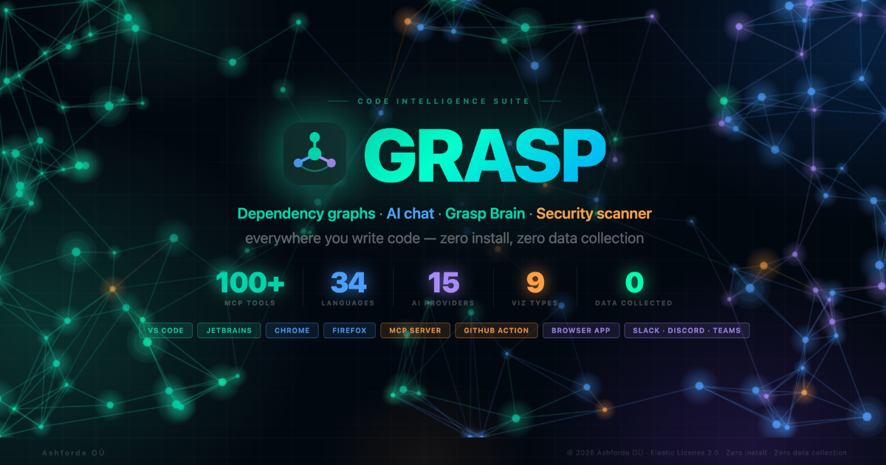

<div align="center">



> [English](README.md) · [हिन्दी](README.hi.md) · [日本語](README.ja.md) · [한국어](README.ko.md) · [简体中文](README.zh.md)

<br/>
<br/>

<a href="https://github.com/ashfordeOU/grasp/actions/workflows/ci.yml" target="_blank"></a>
<a href="https://www.npmjs.com/package/grasp-mcp-server" target="_blank"></a>
<a href="LICENSE" target="_blank"></a>
<a href="https://ashfordeou.github.io/grasp" target="_blank"></a>

<br/>

**130 MCP टूल्स + 8 रिसोर्सेज़ + 2 प्रॉम्प्ट्स · 35 भाषाएँ · 11 AI प्रोवाइडर + OpenRouter के माध्यम से 200+ मॉडल · 10 ग्राफ़ व्यूज़ · शून्य डेटा संग्रह**

<br/>

<a href="https://ashfordeou.github.io/grasp" target="_blank"></a>
&nbsp;
<a href="https://github.com/ashfordeOU/grasp/releases/latest" target="_blank"></a>
&nbsp;
<a href="https://www.npmjs.com/package/grasp-mcp-server" target="_blank"></a>
&nbsp;
<a href="https://plugins.jetbrains.com/plugin/31362-grasp--code-architecture-visualizer" target="_blank"></a>
&nbsp;
<a href="https://addons.mozilla.org/firefox/addon/grasp-code-architecture" target="_blank"></a>
&nbsp;
<a href="https://chromewebstore.google.com/detail/grasp-%E2%80%94-code-architecture/pipmlammandfhfbodllcjolgeolkhapj" target="_blank"></a>
&nbsp;
<a href="https://github.com/ashfordeOU/grasp/releases" target="_blank"></a>
&nbsp;
<a href="https://www.raycast.com/ashfordeOU/grasp" target="_blank"></a>
&nbsp;
<a href="https://zed.dev/extensions?query=grasp" target="_blank"></a>

<br/>

<a href="https://ashfordeou.github.io/grasp" target="_blank">🌐 ब्राउज़र ऐप</a> &nbsp;·&nbsp;
<a href="https://www.npmjs.com/package/grasp-mcp-server" target="_blank">📦 MCP सर्वर</a> &nbsp;·&nbsp;
<a href="https://github.com/ashfordeOU/grasp/issues" target="_blank">🐛 बग रिपोर्ट करें</a> &nbsp;·&nbsp;
<a href="https://github.com/ashfordeOU/grasp/issues" target="_blank">✨ फ़ीचर का अनुरोध करें</a> &nbsp;·&nbsp;
<a href="https://ashfordeou.github.io/grasp/docs/privacy.html" target="_blank">🔒 गोपनीयता</a>

</div>

---

## v3.18.0 में नया क्या है

| श्रेणी | जोड़े गए |
|--------|----------|
| **ग्राफ़ एनालिटिक्स** | `grasp_hub_nodes`, `grasp_bridge_nodes`, `grasp_surprising_connections`, `grasp_knowledge_gaps`, `grasp_suggested_questions` — degree centrality, Brandes betweenness, दुर्लभ क्रॉस-लेयर एज डिटेक्शन, isolated/untested-hotspot finder, ऑटो-जनरेटेड रिव्यू प्रश्न |
| **LLM-context टूल्स** | `grasp_minimal_context` (sub-100-token orientation), `grasp_traverse` (token-budget BFS), `grasp_semantic_search` (function signatures पर cosine similarity), `grasp_apply_refactor` (dry-run preview के साथ rename ops execute) |
| **आर्किटेक्चर इंटेलिजेंस** | `grasp_architecture_overview` — community + hub + question की संयुक्त रिपोर्ट |
| **ग्राफ़ एक्सपोर्ट्स** | `grasp_export_graphml`, `grasp_export_cypher`, `grasp_export_obsidian` — yEd/Gephi GraphML, Neo4j CREATE statements, Obsidian Canvas |
| **इम्पोर्ट रिज़ॉल्वर्स** | TS-config path-alias resolution (`@/components` → `src/components`), Jedi-style Python relative imports + `__init__.py` |
| **वर्कफ़्लोज़** | Claude Code slash commands (`/grasp:build-graph`, `/grasp:review-delta`, `/grasp:review-pr`), token-reduction eval harness (`scripts/eval-token-reduction.mjs`) |
| **ब्राउज़र UX** | Try-it chips, token indicator, snapshot URLs, two-repo compare modal, mid-analysis rate-limit recovery, mobile graph touch gestures, फ्लोटिंग कीबोर्ड-शॉर्टकट popover, per-repo persistence, expanded export menu |
| **i18n** | स्थानीयकृत READMEs — हिन्दी · 日本語 · 한국어 · 简体中文 |

कुल: 130 MCP टूल्स (पहले 121), 13 नए टूल्स, 10 नए ब्राउज़र-UX surfaces, 22 नए unit tests।

---

## Grasp क्या है?

**Grasp** किसी भी GitHub या GitLab रिपॉज़िटरी — क्लाउड या सेल्फ़-होस्टेड — या लोकल कोडबेस को कुछ ही सेकंड में एक इंटरैक्टिव आर्किटेक्चर मानचित्र में बदल देता है। **130 MCP टूल्स** (साथ ही 8 Resources और 2 गाइडेड Prompts) पूरा एनालिसिस इंजन Claude Code, Cursor, और किसी भी MCP-संगत एजेंट के लिए उपलब्ध कराते हैं।

```
URL पेस्ट करें / फ़ोल्डर खोलें  →  AST एनालिसिस इंजन  →  आर्किटेक्चर मानचित्र + 130 MCP टूल्स
```

| | |
|---|---|
| **कोई इंस्टॉलेशन नहीं** | आपके ब्राउज़र में 100% चलता है — दो HTML फ़ाइलें, कोई बिल्ड स्टेप नहीं |
| **कोई डेटा संग्रह नहीं** | आपका कोड कभी आपकी मशीन से बाहर नहीं जाता |
| **कोई अकाउंट नहीं** | URL पेस्ट करें और शुरू हो जाएँ |
| **ऑफ़लाइन भी काम करता है** | इंटरनेट के बिना लोकल फ़ोल्डर्स का विश्लेषण करें |
| **35 भाषाएँ** | JS/TS, Python, Go, Java, Rust, C/C++, C#, Ruby, Swift, Kotlin, Scala, Dart, Elixir, Erlang, Haskell, OCaml, F#, Clojure, Julia, Lua, R, Perl, Shell, PowerShell, Groovy, Zig, V, Nim, Crystal, VBA, Ada/SPARK, Vue, Svelte, PHP |
| **130 MCP टूल्स** | डिपेंडेंसी ग्राफ़, सुरक्षा, **OSV.dev SCA वल्नरेबिलिटी स्कैनिंग**, DORA, ब्रेन स्टोर, Kuzu graph schema v3, communities, ORM tracker, git change impact, आर्किटेक्चर ड्रिफ़्ट डिटेक्शन, टेस्ट कवरेज गैप मैप, ऑर्ग डैशबोर्ड, PR impact action, MCP Resources/Prompts, `grasp setup` एडिटर ऑटो-कॉन्फ़िग |
| **11 AI प्रोवाइडर** *(+ राउटर्स के माध्यम से असीमित)* | प्रत्यक्ष: Anthropic Claude (3 मॉडल), OpenAI (GPT-4o + o-series), Google Gemini (3), Mistral (2), Groq (3), DeepSeek (chat + reasoner), Ollama (local), LM Studio (local), Custom OpenAI-संगत एंडपॉइंट। राउटर्स: OpenRouter (slug के माध्यम से 200+ मॉडल) और Together AI (50+ ओपन-सोर्स मॉडल)। **बातचीत के बीच में बदला जा सकता है**, **डिफ़ॉल्ट रूप से पूरी तरह बंद** (chat panel बंद = शून्य नेटवर्क कॉल), **API keys केवल `localStorage` में संग्रहीत** — Grasp के पास कोई proxy या टेलीमेट्री नहीं है। |
| **10 ग्राफ़ व्यूज़** | Force graph, 3D, arch, treemap, matrix, tree (dendrogram), flow (sankey), bundle, cluster (disjoint), heatmap |
| **Grasp Brain** | SQLite + Kuzu स्थायी स्टोर — एक बार इंडेक्स करें, तुरंत क्वेरी करें। FTS5 + 384D vector embeddings + Cypher graph queries |
| **सप्लाई चेन साइन्ड** | हर रिलीज़ पर SLSA Level 2 npm provenance + Cosign keyless Docker signing |

---

## स्क्रीनशॉट्स

### 🕸️ डिपेंडेंसी ग्राफ़ — देखें कि फ़ाइलें वास्तव में कैसे जुड़ी हैं


### 🏛️ आर्किटेक्चर डायग्राम — आपका कोडबेस लेयर के अनुसार


### 📦 ट्रीमैप — फ़ाइलें लाइन काउंट के अनुसार आकार में


### 🏢 टीम डैशबोर्ड — आपकी सभी रिपॉज़ की सेहत एक नज़र में


---

## क्विक स्टार्ट

### विकल्प 1 — ब्राउज़र (शून्य सेटअप)

```bash
git clone https://github.com/ashfordeOU/grasp.git
open index.html           # मुख्य ऐप
open team-dashboard.html  # टीम डैशबोर्ड
```

कोई बिल्ड स्टेप नहीं। कोई `npm install` नहीं। **दो HTML फ़ाइलें।**

### विकल्प 2 — CLI

```bash
npm install -g grasp-mcp-server

grasp ./my-project        # लोकल फ़ोल्डर का विश्लेषण
grasp facebook/react      # GitHub रिपॉज़ का विश्लेषण
grasp .                   # वर्तमान डायरेक्टरी का विश्लेषण
grasp . --watch           # लाइव मोड — हर फ़ाइल सेव पर ब्राउज़र रीलोड
grasp . --timeline        # टाइम-ट्रैवल — पिछले 30 कमिट्स स्क्रबर के रूप में
grasp . --report          # केवल टर्मिनल रिपोर्ट + JSON आउटपुट
grasp . --format=sarif    # GitHub Code Scanning के लिए SARIF एक्सपोर्ट
grasp . --pr-comment      # GitHub PR comment markdown को stdout पर प्रिंट करें
grasp . --check           # grasp.yml आर्किटेक्चर नियम लागू करें (CI gate)
```

### विकल्प 3 — IDE एक्सटेंशन्स

| IDE | इंस्टॉल करें |
|-----|---------|
| **VS Code** | [Install (.vsix)](https://github.com/ashfordeOU/grasp/releases/latest) — `grasp-vscode-3.18.0.vsix` डाउनलोड करें और **Extensions: Install from VSIX…** (`Cmd+Shift+P`) चलाएँ |
| **JetBrains** | [JetBrains Marketplace](https://plugins.jetbrains.com/plugin/31362-grasp--code-architecture-visualizer) — Settings → Plugins में **Grasp** खोजें |
| **Raycast** | [Raycast Store](https://www.raycast.com/ashfordeOU/grasp) — या Raycast एक्सटेंशन स्टोर में **Grasp** खोजें |
| **Zed** | [Zed Extensions](https://zed.dev/extensions?query=grasp) — या Zed → Extensions में **grasp** खोजें |

### विकल्प 4 — ब्राउज़र एक्सटेंशन

| ब्राउज़र | इंस्टॉल करें |
|---------|---------|
| **Chrome** | [Chrome Web Store](https://chromewebstore.google.com/detail/grasp-%E2%80%94-code-architecture/pipmlammandfhfbodllcjolgeolkhapj) |
| **Firefox** | [Firefox Add-ons](https://addons.mozilla.org/firefox/addon/grasp-code-architecture) — ID: `grasp@ashforde.org` |
| **Safari** | [GitHub Releases](https://github.com/ashfordeOU/grasp/releases) — [sideload निर्देश](#safari-sideload) देखें |

हर GitHub और GitLab पेज पर एक फ़्लोटिंग **Grasp** बटन दिखाई देता है। ऑन-डिमांड अनुमति के माध्यम से सेल्फ़-होस्टेड GitLab, GitHub Enterprise, और किसी भी कस्टम होस्ट का समर्थन करता है।

---

### वितरण एक नज़र में

हर टैग की गई रिलीज़ स्वचालित रूप से सभी चैनलों पर प्रकाशित होती है:

| चैनल | स्थिति | लिंक |
|---------|--------|------|
| **npm** (`grasp-mcp-server`) | [](https://www.npmjs.com/package/grasp-mcp-server) | `npm install -g grasp-mcp-server` |
| **MCP Registry** | सूचीबद्ध | [modelcontextprotocol.io](https://mcpregistry.com) |
| **Docker** (`ghcr.io/ashfordeou/grasp`) | [](https://github.com/ashfordeOU/grasp/pkgs/container/grasp) | `docker pull ghcr.io/ashfordeou/grasp:latest` |
| **VS Code** | Releases पर `.vsix` | [GitHub Releases](https://github.com/ashfordeOU/grasp/releases/latest) |
| **JetBrains** | Marketplace | [Plugin ID 31362](https://plugins.jetbrains.com/plugin/31362-grasp--code-architecture-visualizer) |
| **Raycast** | Store (PR सबमिट किया गया) | [raycast.com/ashfordeOU/grasp](https://www.raycast.com/ashfordeOU/grasp) |
| **Zed** | Extension (PR सबमिट किया गया) | [zed.dev/extensions](https://zed.dev/extensions?query=grasp) |
| **Chrome** | Web Store | [CWS listing](https://chromewebstore.google.com/detail/grasp-%E2%80%94-code-architecture/pipmlammandfhfbodllcjolgeolkhapj) |
| **Firefox** | AMO (सूचीबद्ध) | [addons.mozilla.org](https://addons.mozilla.org/firefox/addon/grasp-code-architecture) |
| **Safari** | Sideload (macOS 13+) | [GitHub Releases](https://github.com/ashfordeOU/grasp/releases) |
| **GitLab bot image** | `ghcr.io/ashfordeou/grasp-gitlab-bot` | हर रिलीज़ पर ऑटो-पुश किया जाता है |
| **GitLab tunnel agent** | Releases पर बाइनरी | [GitHub Releases](https://github.com/ashfordeOU/grasp/releases) |
| **GitHub Release** | साइन्ड + चेकसम | [Releases page](https://github.com/ashfordeOU/grasp/releases) |

### AI-tool इंटीग्रेशन्स *(आपके असिस्टेंट द्वारा MCP या एक्सटेंशन के माध्यम से Grasp को कॉल किया जाता है)*

| AI टूल | इंस्टॉल कैसे करें | नोट्स |
|---------|----------------|-------|
| **Claude Code** | `claude mcp add grasp -- npx -y grasp-mcp-server` | नेटिव MCP — सभी 130 टूल्स + 8 Resources + 2 Prompts |
| **Cursor** | `~/.cursor/mcp.json` में `grasp-mcp-server` जोड़ें | नेटिव MCP |
| **Cline / Roo Code / Kilo Code** | VS Code सेटिंग्स में MCP कॉन्फ़िग | नेटिव MCP |
| **Windsurf** | MCP कॉन्फ़िग | नेटिव MCP |
| **Codex / OpenCode / Trae / Droid** | MCP कॉन्फ़िग | नेटिव MCP — `grasp setup` स्वचालित रूप से सभी कॉन्फ़िगर करता है |
| **Gemini CLI / Grok CLI** | MCP कॉन्फ़िग | नेटिव MCP |
| **GitHub Copilot Chat** | `grasp-copilot-extension` इंस्टॉल करें | Copilot Grasp को Copilot Extension API के माध्यम से कॉल करता है — chat में `@grasp` मेंशन |
| **Continue** | `continue-provider` package | Continue context provider के रूप में Grasp |
| **Amazon Q Developer** | `amazon-q-plugin` | Q के chat में Grasp उभरता है |
| **GPT Actions / Custom GPTs** | `gpt-actions` package | OpenAI Actions schema के लिए REST के रूप में उजागर |
| **Aider / Sweep / कोई भी टूल** | `grasp-mcp-server` npm पैकेज का उपयोग करें | टूल-अज्ञेय stdio JSON-RPC |

<details>
<summary id="safari-sideload">🧭 Safari Sideload निर्देश</summary>

```bash
curl -sL https://github.com/ashfordeOU/grasp/releases/latest/download/grasp-safari-extension.zip \
  -o /tmp/grasp-safari.zip \
  && unzip -q /tmp/grasp-safari.zip -d /tmp/grasp-safari \
  && mv /tmp/grasp-safari/Grasp.app /Applications/ \
  && open /Applications/Grasp.app
```

फिर Safari में: **Settings → Extensions → Grasp को सक्षम करें**। यदि यह दिखाई नहीं देता है, तो पहले **Safari → Develop → Allow Unsigned Extensions** सक्षम करें।

</details>

---

## यह कैसे काम करता है

```
┌──────────────────────────────────────────────────────────────────┐
│  Input                                                            │
│  github.com/owner/repo  ·  gitlab.com/ns/proj  ·  ./local/path   │
└────────────────────────────────┬─────────────────────────────────┘
                                 ▼
┌──────────────────────────────────────────────────────────────────┐
│  Analysis Pipeline  (mcp/src/)                                    │
│                                                                   │
│  1. scan        file enumeration + gitignore                      │
│  2. parse       tree-sitter AST · 35 languages · 16 native        │
│  3. routes      HTTP route detection (Express/FastAPI/Gin)        │
│  4. tools       MCP/gRPC tool definition detection                │
│  5. orm         ORM query tracking (Prisma/TypeORM/Sequelize/SA)  │
│  6. scope       3-tier call resolver  (0.95 → 0.90 → 0.50)       │
│  7. types       cross-file type propagation  (Kahn topo-sort)     │
│  8. coverage    test-file detection → TESTS/COVERS edges (v3)     │
│  9. communities Louvain community detection on import graph       │
│ 10. processes   BFS execution-flow tracing from entry points      │
└───────────┬──────────────────────────┬────────────────────────────┘
            │                          │
    ┌───────▼────────┐      ┌──────────▼──────────┐
    │  Browser App   │      │   MCP Server (CLI)   │
    │  index.html    │      │   grasp-mcp-server   │
    │                │      │                      │
    │  10 graph views│      │  130 tools           │
    │  16 color modes│      │  8 Resources         │
    │  AI Chat       │      │  2 guided Prompts    │
    │  Ask Grasp     │      │  Brain + Kuzu v3     │
    │  Coverage Ovly │      │  grasp setup (5 eds) │
    │  VULN tab      │      │  grasp vulns / drift │
    └────────────────┘      └──────────────────────┘
```

---

## विज़ुअलाइज़ेशन

### ग्राफ़ प्रकार

| व्यू | विवरण |
|------|-------------|
| 🕸️ **Graph** | Force-directed डिपेंडेंसी ग्राफ़ — drag, zoom, multi-select |
| 🔮 **3D Graph** | त्रि-आयामी force graph — rotate, pan, zoom |
| 🏛️ **Arch** | परत-दर-परत आर्किटेक्चर डायग्राम |
| 📦 **Treemap** | फ़ाइलें लाइन काउंट के अनुसार आकार में, फ़ोल्डर द्वारा समूहीकृत |
| 📊 **Matrix** | सभी डिपेंडेंसी दिखाने वाला adjacency matrix |
| 🌳 **Tree** | पदानुक्रमित cluster dendrogram |
| 🌊 **Flow** | फ़ोल्डर-स्तरीय Sankey डिपेंडेंसी फ़्लो |
| 🎯 **Bundle** | arc-आधारित कनेक्शन के साथ गोलाकार लेआउट |
| 🔮 **Cluster** | प्रति फ़ोल्डर अलग-अलग force ग्राफ़ |

### कलर मोड्स

| मोड | क्या दिखाता है |
|------|---------------|
| 📁 **Folder** | डायरेक्टरी संरचना |
| 🏗️ **Layer** | आर्किटेक्चरल लेयर (UI, Services, Utils, आदि) |
| 🔥 **Churn** | कमिट फ़्रीक्वेंसी — लाल = सबसे अधिक बदले गए हॉटस्पॉट |
| ⚡ **Complexity** | Cyclomatic complexity (हरा → पीला → लाल) |
| 💥 **Blast** | चयनित फ़ाइल के लिए blast radius प्रभाव |
| 🌊 **Depth** | अधिकतम brace-nesting गहराई |
| 🔎 **Dup** | डुप्लिकेट कोड घनत्व — लाल = कई क्लोन |
| 👤 **Owner** | शीर्ष योगदानकर्ता — bus-factor जोखिम पहचानें |
| 🐛 **Issues** | प्रति फ़ाइल लिंक्ड GitHub Issues |
| 🧪 **Coverage** | टेस्ट कवरेज — अनटेस्टेड फ़ाइलों को हाइलाइट करें |
| 📦 **Bundle** | Bundle साइज़ योगदान |
| 🌐 **API Surface** | सार्वजनिक-सामना करने वाली फ़ाइल एक्सपोज़र |
| ⚡ **Runtime** | लाइव ट्रेस से वास्तविक कॉल फ़्रीक्वेंसी |
| 🔒 **Safety** | सुरक्षा गेट कवरेज (हरा = gated, लाल = ungated) |
| 🧪 **Boundary** | अनुसंधान/उत्पादन सीमा drift |
| 🧪 **Eval Coverage** | eval/test स्क्रिप्ट से कवरेज |

---

## कोड इंटेलिजेंस

### 📊 हेल्थ स्कोर
डेड कोड, सर्कुलर डिपेंडेंसी, coupling मेट्रिक्स, और सुरक्षा मुद्दों के आधार पर तुरंत **A–F ग्रेड**। एक स्कोर (0–100) के रूप में visual bar के साथ प्रदर्शित।

### 🔐 सुरक्षा स्कैनर
Hardcoded secrets और API keys, SQL injection जोखिम, खतरनाक `eval()` उपयोग, और प्रोडक्शन में छोड़े गए debug स्टेटमेंट का स्वचालित डिटेक्शन।

### 🛡️ डिपेंडेंसी वल्नरेबिलिटी स्कैनर *(v3.17.0)*
हर विश्लेषण पर [OSV.dev](https://osv.dev) मुफ़्त सार्वजनिक CVE डेटाबेस के विरुद्ध घोषित डिपेंडेंसी स्कैन करता है। `package.json` (`package-lock.json` resolution के साथ), `requirements.txt`, `pyproject.toml`, `go.mod`, `Cargo.toml` (`Cargo.lock` resolution के साथ), और `pom.xml` का समर्थन करता है। CVSS स्कोर और फ़िक्स-वर्जन सुझावों के साथ severity-वर्गीकृत परिणाम। दाएँ पैनल में नया **VULN** टैब; नया `grasp_vulnerabilities` MCP टूल; नया `grasp vulns <path>` CLI जो critical/high निष्कर्षों पर 1 के साथ exit करता है (CI-अनुकूल)। हेल्थ स्कोर प्रति critical –5 और प्रति high –3 घटाता है। **100% client-side** — OSV अनुरोध सीधे आपके ब्राउज़र से OSV.dev जाते हैं, कभी Grasp सर्वर के माध्यम से नहीं। 24-घंटे localStorage cache; नेटवर्क विफलता पर चुपचाप degrade होता है।

### 🧩 पैटर्न डिटेक्शन
Singleton, Factory, Observer/Event पैटर्न, React hooks, और anti-patterns (God Objects, उच्च coupling) — स्वचालित रूप से पहचानता है।

### 💥 Blast Radius विश्लेषण
*"यदि मैं इस फ़ाइल को बदलूँ, तो क्या टूटेगा?"* — कोई भी फ़ाइल चुनें और हर downstream फ़ाइल देखें जो प्रभावित होगी, ग्राफ़ पर हाइलाइट की गई।

### 🔥 Activity Heatmap
फ़ाइलों को कमिट फ़्रीक्वेंसी के अनुसार रंग देता है। GitHub रिपॉज़ (API के माध्यम से) और **लोकल रिपॉज़** (`git log` के माध्यम से — कोई इंटरनेट आवश्यक नहीं) के लिए काम करता है।

### 🔎 डुप्लिकेट और समानता डिटेक्शन
**Dup** कलर मोड सटीक या निकट-डुप्लिकेट कोड वाली फ़ाइलों को हाइलाइट करता है। `grasp_similarity` MCP टूल लक्षित रिफ़ैक्टरिंग के लिए रैंक्ड डुप्लिकेट क्लस्टर लौटाता है।

### 👥 कोड स्वामित्व
Git history से प्रति फ़ाइल शीर्ष योगदानकर्ता, line-percentage breakdowns के साथ। GitHub Blame पर एक-क्लिक jump।

### 📋 PR Impact विश्लेषण
PR URL पेस्ट करें कि कौन सी फ़ाइलें यह छूता है और मर्ज से पहले प्रस्तावित परिवर्तनों के blast radius की गणना करें।

### 💰 तकनीकी ऋण मात्रा-निर्धारण
कॉन्फ़िगरेबल अनुमानों का उपयोग करके हर आर्किटेक्चरल मुद्दे को developer-hours में बदलता है — circular dep = 4h, god file = 16h, critical security = 8h — coupling multiplier के साथ। हेल्थ पैनल और टीम डैशबोर्ड में दिखाया गया।

### 🔗 साझा करने योग्य Embeds
तैयार-से-पेस्ट `<iframe>`, README badge, React snippet, और सीधा लिंक के लिए `⋯ → 🔗 Embed` क्लिक करें — डॉक्स, wikis, या डैशबोर्ड में लाइव हेल्थ रिपोर्ट साझा करें।

### 🎯 कनेक्शन कॉन्फ़िडेंस स्कोरिंग *(v3.16.0)*
हर cross-file कनेक्शन को 0–1 स्कोर किया जाता है: स्पष्ट static imports = 1.0, same-folder = 0.8, cross-folder inferred = 0.6, low-frequency = 0.4। Force graph confidence को edge opacity के रूप में overlay करता है — low-confidence edges को फ़िल्टर करने के लिए ⚙ settings में slider का उपयोग करें।

### 🔍 ग्राफ़ क्वेरी मोडल *(v3.16.0)*
ग्राफ़ छोड़े बिना in-browser फ़ाइलों, फ़ंक्शनों, और edges को खोजने के लिए 🔍 toolbar बटन क्लिक करें। मैच लाइव अपडेट होते हैं — ग्राफ़ पर उस पर jump करने के लिए किसी भी फ़ाइल परिणाम पर क्लिक करें।

### ƒ() फ़ंक्शन-स्तरीय कैनवास *(v3.16.0)*
Force graph को file-level से function-level नोड्स में बदलने के लिए `ƒ()` बटन टॉगल करें — व्यक्तिगत function call संबंध देखें, performance के लिए 300 नोड्स पर capped।

### 🗄️ DB Coupling टैब *(v3.16.0)*
दायाँ पैनल **🗄️ DB** टैब ORM patterns (Django, TypeORM, raw SQL) के लिए फ़ाइल सामग्री scan करता है, mapping कि कौन सी फ़ाइलें कौन सी टेबल का संदर्भ देती हैं। तुरंत god-tables और high-coupling फ़ाइलें पहचानें।

### 🎯 Good First Issues टैब *(v3.16.0)*
**🎯 GFI** टैब isolated, low-complexity, untested फ़ाइलों को surface करता है — नए इंजीनियरों या AI coding agents के लिए आदर्श योगदान लक्ष्य।

### 🔐 PII डिटेक्शन और सुरक्षा उप-श्रेणियाँ *(v3.16.0)*
Security टैब में अब उप-श्रेणी pills हैं — **ALL / SECRETS / INJECTION / PII / EVAL** — निष्कर्षों को फ़िल्टर करने के लिए। PII pill source फ़ाइलों में email, phone, SSN, credit card, और API key patterns के लिए फ़ाइल सामग्री स्कैन करता है।

### 📸 आर्किटेक्चर ड्रिफ़्ट डिटेक्शन *(v3.17.0)*
अपने codebase आर्किटेक्चर का snapshot लें और समय के साथ drift का पता लगाएँ — स्वचालित रूप से।

```bash
grasp snapshot ./my-project --name before-refactor
# ... परिवर्तन करें ...
grasp drift ./my-project          # यदि drift CRITICAL है तो 1 के साथ exit (CI-अनुकूल)
```

| MCP टूल | विवरण |
|----------|-------------|
| `grasp_snapshot` | वर्तमान हेल्थ स्कोर, coupling मेट्रिक्स, circular deps, और top-10 hotspots को नामित snapshot के रूप में सहेजें |
| `grasp_diff_snapshots` | किन्हीं दो snapshots की तुलना करें — हेल्थ delta, नई circular deps, फ़ाइलें जिनकी coupling >20% बढ़ी, drift level (STABLE / DEGRADED / CRITICAL) लौटाता है |

Snapshots `~/.grasp/brain.db` में संग्रहीत हैं और विश्लेषण सत्रों में बने रहते हैं।

### 🧪 टेस्ट कवरेज गैप मैप *(v3.17.0)*
सबसे अधिक प्रोडक्शन घटनाओं का कारण बनने की संभावना वाले फ़ंक्शन खोजें — उच्चतम call count, शून्य टेस्ट कवरेज।

```bash
grasp_coverage_gaps  # MCP के माध्यम से — call_count DESC द्वारा sorted uncovered_functions लौटाता है
```

डिपेंडेंसी ग्राफ़ को **🧪 Coverage overlay** टॉगल मिलता है — uncovered फ़ंक्शन लाल में, partially-covered amber में, covered हरे में रेंडर होते हैं। कवरेज स्थिर विश्लेषण द्वारा अनुमानित है: Grasp टेस्ट फ़ाइलों (`*.test.*`, `*.spec.*`, `test_*`, `*_test.*`) का पता लगाता है और ट्रेस करता है कि वे किन source फ़ंक्शन का संदर्भ देती हैं।

| MCP टूल | विवरण |
|----------|-------------|
| `grasp_coverage_gaps` | `uncovered_functions` (call count द्वारा sorted), `risky_uncovered` (high churn + no tests), प्रति डायरेक्टरी `coverage_by_module`, और `overall_coverage_estimate` लौटाता है |

### 🏢 Org-स्तरीय डैशबोर्ड *(v3.17.0)*
एक कमांड में पूरे GitHub संगठन का विश्लेषण करें:

```bash
grasp org my-github-org --token ghp_xxx --format html   # स्व-निहित HTML डैशबोर्ड
grasp org my-github-org --format json                   # CI-उपभोग योग्य JSON
grasp org my-github-org --format md                     # Wikis के लिए Markdown
```

सभी रिपॉज़ (500 तक, 5 समवर्ती) में हेल्थ ग्रेड, सुरक्षा निष्कर्ष, सबसे अधिक churned फ़ाइलें, और भाषा वितरण को aggregate करता है। HTML आउटपुट Chart.js को inline embed करता है — कोई बाहरी डिपेंडेंसी नहीं।

| MCP टूल | विवरण |
|----------|-------------|
| `grasp_org_summary` | किसी संगठन में 20 शीर्ष रिपॉज़ तक का विश्लेषण करें — aggregate हेल्थ ग्रेड, ग्रेड वितरण, severity द्वारा कुल सुरक्षा निष्कर्ष, top churned फ़ाइलें, भाषा breakdown लौटाता है |

### 🤖 PR Impact GitHub Action *(v3.17.0)*
हर pull request में स्वचालित आर्किटेक्चरल impact विश्लेषण जोड़ें:

```yaml
# .github/workflows/grasp-pr-impact.yml
- uses: ashfordeOU/grasp/.github/actions/grasp-pr-impact@main
  with:
    github-token: ${{ secrets.GITHUB_TOKEN }}
    min-risk-to-comment: LOW      # LOW / MEDIUM / HIGH / CRITICAL
    fail-on-risk: CRITICAL        # इस जोखिम स्तर पर CI check विफल करें
```

Action एक संरचित PR comment पोस्ट करता है जो दिखाता है:
- रंग कोडिंग के साथ **जोखिम badge** (LOW / MEDIUM / HIGH / CRITICAL)
- function-level blast radius के साथ बदली गई फ़ाइलें
- प्रभावित execution processes (step counts के साथ)
- `git blame` से सुझाए गए reviewers (प्रति प्रभावित फ़ाइल top 2 contributors)
- टेस्ट कवरेज गैप: कौन से बदले गए फ़ंक्शनों के पास कोई टेस्ट फ़ाइल नहीं है जो उन्हें छूती हो

---

## AI Chat — 15 प्रोवाइडर

बिल्ट-इन AI असिस्टेंट जो आपके पूरे codebase को जानता है। पूछें *"auth.ts hotspot क्यों है?"*, *"रिफ़ैक्टर के लिए कौन सी फ़ाइलें सबसे सुरक्षित हैं?"*, या *"इस call chain में सुरक्षा मुद्दों की व्याख्या करें"* — उत्तर आपके लाइव डिपेंडेंसी ग्राफ़, सुरक्षा निष्कर्षों, और आर्किटेक्चरल लेयर का संदर्भ देते हैं।

| प्रोवाइडर | मॉडल |
|----------|--------|
| **Anthropic** | Claude Opus 4.7, Sonnet 4.6, Haiku 4.5 |
| **OpenAI** | GPT-4o, GPT-4o mini, o3-mini, o1 |
| **Google Gemini** | Gemini 2.0 Flash, 1.5 Pro, 1.5 Flash |
| **Mistral** | Mistral Small, Mistral Large |
| **Groq** | Llama 3.3 70B, 3.1 8B, Gemma 2 9B |
| **DeepSeek** | DeepSeek Chat, DeepSeek Reasoner |
| **OpenRouter** | कोई भी मॉडल slug (एक key के माध्यम से 100+ मॉडल) |
| **Together AI** | कोई भी मॉडल slug |
| **Ollama** | लोकल मॉडल (कोई key आवश्यक नहीं) |
| **LM Studio** | किसी भी पोर्ट पर लोकल मॉडल |
| **Custom** | कोई भी OpenAI-संगत base URL |

**विशेषताएँ:**
- मल्टी-टर्न बातचीत मेमोरी — पेज रिफ़्रेश के बीच `localStorage` में persist होती है
- चयनित-फ़ाइल context — फ़ाइल चुने जाने पर layer, functions, complexity, और मुद्दे स्वचालित रूप से inject होते हैं
- समृद्ध codebase context — मेटाडेटा के साथ शीर्ष 80 फ़ाइलें, सभी मुद्दे, सुरक्षा निष्कर्ष, circular deps, layer breakdown
- Syntax-highlighted कोड ब्लॉक्स के साथ Markdown rendering
- API key केवल आपके ब्राउज़र में रहती है, चुने गए प्रोवाइडर के अलावा कहीं नहीं भेजी जाती

---

## Grasp Brain — स्थायी आर्किटेक्चर इंटेलिजेंस *(v3.16.0)*

Grasp Brain दो स्थायी स्टोर्स को मिलाता है जो एक साथ काम करते हैं:

- **SQLite Brain** (`~/.grasp/brain.db`) — फ़ाइल मेटाडेटा, coupling, security, और issue index। फ़ंक्शनों पर FTS5 full-text index और in-process 384D vector embedding store (Xenova/all-MiniLM-L6-v2 — कोई क्लाउड डिपेंडेंसी नहीं) शामिल है। एक बार इंडेक्स करें, तुरंत क्वेरी करें।
- **Kuzu Graph DB** (`~/.grasp/graph/`) — Cypher क्वेरी समर्थन के साथ नेटिव graph database। पूरे function call graph, फ़ाइल imports, और type relationships को traversable property graph के रूप में संग्रहीत करता है।

एक बार इंडेक्स करें, फिर तुरंत क्वेरी करें — कोई पुनः-विश्लेषण आवश्यक नहीं। हर फ़ंक्शन को उन execution processes के साथ टैग किया जाता है जिनमें यह भाग लेता है (entry points से BFS), इसलिए search परिणामों में एक `processes[]` फ़ील्ड शामिल है जो flow द्वारा matches को समूहीकृत करता है।

### यह कैसे काम करता है

```
grasp index ./my-project    →  विश्लेषण ~/.grasp/brain.db में संग्रहीत
grasp context src/api.ts    →  संग्रहीत index से तुरंत फ़ाइल context
grasp diff ./my-project     →  संग्रहीत baseline बनाम वर्तमान स्थिति की तुलना
grasp daemon ./my-project   →  परिवर्तनों के लिए watch करें, स्वचालित रूप से re-index करें
```

### CLI Subcommands

```bash
grasp index <path>           # रिपॉज़ का विश्लेषण और brain में persist करें
grasp context <src> <file>   # किसी भी फ़ाइल के लिए समृद्ध context प्राप्त करें
grasp setup [path]           # Claude Code / Cursor / Windsurf में hooks इंस्टॉल करें
grasp diff <path>            # brain baseline बनाम वर्तमान विश्लेषण की तुलना
grasp daemon <path>          # डायरेक्टरी देखें और परिवर्तनों पर ऑटो-reindex करें
grasp drift [path]           # Snapshot + पिछले snapshot बनाम diff; CRITICAL पर 1 exit
grasp org <github-org>       # Org-स्तरीय डैशबोर्ड (--format json|html|md --token ghp_xxx)
```

### Ask Grasp — प्राकृतिक भाषा आर्किटेक्चर क्वेरी

ब्राउज़र ऐप (Ask Grasp panel) और `grasp_ask` MCP टूल दोनों आपके codebase के बारे में सादे-अंग्रेज़ी प्रश्नों का समर्थन करते हैं। `grasp_ask` संरचनात्मक intents को सीधे पहचानता है; ओपन-एंडेड क्वेरी के लिए यह **hybrid semantic search** पर वापस आता है — BM25 full-text + Reciprocal Rank Fusion के साथ merged 384D vector embeddings।

प्रश्न-उत्तर लेयर के बिना शुद्ध semantic search के लिए, सीधे `grasp_search` का उपयोग करें — परिणामों में एक `processes[]` फ़ील्ड शामिल है जो दिखाता है कि प्रत्येक match किस execution flow से संबंधित है।

| प्रश्न | आपको क्या मिलता है |
|----------|--------------|
| *"सबसे जटिल फ़ाइलें कौन सी हैं?"* | Cyclomatic complexity द्वारा रैंक की गई फ़ाइलें |
| *"मुझे coupling hotspots दिखाएँ"* | उच्चतम संयुक्त fan-in + fan-out वाली फ़ाइलें |
| *"कोई सुरक्षा मुद्दे?"* | codebase में सभी सुरक्षा निष्कर्ष |
| *"auth.ts का blast radius क्या है?"* | पूरी transitive impact सूची |
| *"डेटा एक्सेस कौन सी layer संभालती है?"* | फ़ाइल उदाहरणों के साथ layer breakdown |
| *"समग्र ग्रेड क्या है?"* | हेल्थ स्कोर, ग्रेड, मुद्दा सारांश |
| *"किन फ़ाइलों में सबसे अधिक churn है?"* | Commit फ़्रीक्वेंसी रैंकिंग |
| *"क्या circular dependencies हैं?"* | severity के साथ cycle list |

### Registry — सभी इंडेक्स की गई रिपॉज़

`grasp_registry_list` और `grasp_registry_status` पूरे Brain index को expose करते हैं:

```bash
# MCP के माध्यम से
grasp_registry_list          # सभी रिपॉज़: हेल्थ ग्रेड, फ़ाइलें, फ़ंक्शन, सक्रिय सत्र
grasp_registry_status        # aggregate: indexed count, session count, ग्रेड वितरण

# HTTP के माध्यम से (जब MCP server --http के साथ चलता है)
curl http://localhost:7332/api/v1/registry
```

टीम डैशबोर्ड **🗂️ Registry panel** लोड पर इसे ऑटो-fetch करता है — कोई session_id आवश्यक नहीं।

### Arch Diff

`grasp diff` (और `grasp_arch_diff` MCP टूल) आपके वर्तमान codebase की संग्रहीत brain baseline से तुलना करता है और उभारता है:
- ग्रेड degradations (फ़ाइलें जो खराब हुईं: A→B, B→C, आदि)
- हेल्थ स्कोर delta
- Baseline के बाद से प्रस्तुत नए सुरक्षा मुद्दे

### Editor Hooks (`grasp setup`)

आपकी रिपॉज़ में `.claude/`, `.cursor/`, `.windsurf/` का पता लगाता है और एक pre-tool-use hook इंस्टॉल करता है जो स्वचालित रूप से हर action से पहले आपके AI coding assistant को codebase context देता है। आर्किटेक्चर सारांश के साथ `CLAUDE.md` और `AGENTS.md` भी लिखता है।

---

## टीम और सहयोग

### 🏢 टीम डैशबोर्ड

एक view में कई रिपॉज़ की सेहत ट्रैक करें। कोई भी सार्वजनिक (या निजी, टोकन के साथ) GitHub रिपॉज़ जोड़ें और देखें:

- हेल्थ स्कोर, ग्रेड, फ़ाइलें, मुद्दे, circular deps, सुरक्षा निष्कर्ष, आर्किटेक्चरल layers
- **Pattern count, Env var issues, Feature flag count** — नए v3.13.0 कॉलम
- **DORA metrics mini-card** — प्रति रिपॉज़ Deploy Frequency, Lead Time, Change Fail Rate, MTTR (expandable पंक्ति)
- **🗂️ Registry panel** — लाइव हेल्थ ग्रेड और session स्थिति के साथ सभी Brain-indexed रिपॉज़
- Commit गतिविधि (7d / 30d) और CI status (✅/❌/⏳)
- Commit velocity sparkline, developer-days में Technical debt
- पूरी टेबल को **CSV या JSON** के रूप में एक्सपोर्ट करें। 📁 Open Folder (File System Access API) के साथ लोकल फ़ोल्डर खोलें।

### 🔄 लाइव टीम सहयोग

Grasp का CLI आपकी पूरी टीम के लिए एक रीयल-टाइम सहयोग सर्वर होस्ट करता है:

```bash
npx grasp --host=0.0.0.0 --room-secrets=backend:pass1,frontend:pass2
#   → main app:       http://server-ip:7331/
#   → team dashboard: http://server-ip:7331/dashboard
#   → health check:   http://server-ip:7331/api/health
```

- **WebSocket sync** — workspace परिवर्तन सभी कनेक्ट किए गए टीम सदस्यों तक तुरंत propagate होते हैं
- **Named rooms** — `?sync_room=backend-team` प्रत्येक टीम के workspace को isolate करता है
- **Presence indicators** — Sync पैनल में देखें कि कौन ऑनलाइन है
- **Share links** — ⎘ Copy team link या 👁 Copy read-only link
- **Read-only mode** — observers के लिए `?readonly=1`
- **Password protection** — `--room-secrets=room:password`
- **REST API** — `GET /api/health` · `GET /api/rooms` · `GET/PUT /api/workspace/:room`

> **LAN hosting:** एक ही नेटवर्क पर कोई भी `http://server-ip:7331/dashboard` एक्सेस करता है — कोई क्लाउड आवश्यक नहीं।

### 🏢 Monorepo और Workspace समर्थन

Grasp स्वचालित रूप से monorepos में sub-packages का पता लगाता है (`package.json`, `pyproject.toml`, `Cargo.toml`, `go.mod`, `pom.xml`)। एक **Workspace** साइडबार आपको एक package में फ़िल्टर करने देता है — सभी ग्राफ़, treemaps, और मेट्रिक्स तुरंत अपडेट होते हैं।

### ⏮️ Time-Travel आर्किटेक्चर Scrubber

अपने पिछले 30 git commits को scrubber पैनल के रूप में लोड करने के लिए `grasp . --timeline` चलाएँ। किसी भी commit पर slider drag करें — बदले गए नोड्स ग्राफ़ पर पीले चमकते हैं ताकि आप अपने आर्किटेक्चर को समय के साथ विकसित होते देख सकें।

### 📡 लाइव Watch मोड

रीयल-टाइम SSE sync के साथ लोकल dev server के लिए `grasp . --watch` चलाएँ। हर फ़ाइल save ब्राउज़र ग्राफ़ को स्वचालित रूप से रीलोड करता है — कनेक्ट होने पर एक `LIVE` बैज दिखाई देता है।

---

## उद्योग वर्टिकल

### ✈️ एयरोस्पेस / सुरक्षा-गंभीर

| विशेषता | विवरण |
|---------|-------------|
| **Requirement Traceability** | एक requirements CSV अपलोड करें — Grasp `@REQ-NNN` टैग के लिए स्कैन करता है और कवरेज %, missing, और unspecified फ़ाइलें दिखाता है। एक-क्लिक compliance matrix एक्सपोर्ट। |
| **MISRA / Safety Mode** | `⋯ → 🔧 Safety Mode` — MISRA C/C++ और Ada उल्लंघनों का पता लगाएँ: init के बाद dynamic allocation, recursive calls, `goto`, `abort()`/`exit()`। |
| **DO-178C / ECSS Certification Export** | एक-क्लिक certification evidence package: inventory, traceability matrix, complexity, MISRA उल्लंघन, सुरक्षा निष्कर्ष — JSON और प्रिंट करने योग्य HTML। |
| **Anomaly Investigation** | फ़ाइल चुनें → 🔍 Anomaly Investigation — callers, callees, transitive blast radius, हाल के commits, call path में security, सादे-अंग्रेज़ी सारांश। |
| **Software Reuse Assessor** | Interface Compatibility, Dependencies, Safety Level, Architecture Fitness, Security, Complexity में traffic-light matrix। |
| **Cross-language Call Graph** | Ada→C `pragma Import`, Python `ctypes`/`cffi`, JS→WASM सीमाएँ। |
| **Heritage Software Genealogy** | एक origin-mission manifest overlay करें, zero-delta certification shortcuts पहचानें। |
| **ICD Mapper** | Interface Control Document entries को exported functions से match करें, अकार्यान्वित interfaces flag करें। |
| **ECSS-E-ST-40C Compliance** | DI-01, DI-04, DI-07, DI-10, DI-15 compliance आवश्यकताएँ check करें। |

### 🧠 AI अनुसंधान

| विशेषता | विवरण |
|---------|-------------|
| **Safety Constraint Tracer** | safety gates (filters, sanitizers) चिह्नित करें — हर entry→output पथ trace करें और किसी भी path को flag करें जो सभी gates को bypass करता है। नया **Safety** कलर मोड। |
| **Research/Production Boundary** | research बनाम production फ़ोल्डरों को परिभाषित करें — production फ़ाइलों को flag करें जो research code से import करती हैं। |
| **Jupyter Notebook Support** | डिपेंडेंसी ग्राफ़ में `.ipynb` — code cells निकालता है, imports parse करता है, reproducibility मुद्दे flag करता है। |
| **Training Run Diff** | दो YAML/JSON configs अपलोड करें — hyperparameters diff करें और खोजें कि कौन सी फ़ाइलें प्रत्येक बदले गए key को पढ़ती हैं। |
| **Eval Coverage Map** | eval scripts का स्वचालित पता लगाता है और trace करता है कि वे किस model/training code का उपयोग करती हैं। eval coverage के बिना safety gates को critical के रूप में flag किया जाता है। |
| **ML Pipeline DAG** | PyTorch, TensorFlow, JAX, HuggingFace patterns का पता लगाता है — Data→Model→Training→Eval→Checkpoint DAG render करता है। |

### 🏢 एंटरप्राइज़

| विशेषता | विवरण |
|---------|-------------|
| **SBOM Generation** | npm, pip, Cargo, Go modules के लिए CycloneDX 1.4 या SPDX 2.3 JSON। OSV API के माध्यम से वैकल्पिक CVE enrichment। |
| **DORA Metrics** | GitHub Actions से Deployment Frequency, Lead Time, Change Failure Rate, MTTR। Elite/High/Medium/Low वर्गीकरण। |
| **AI-Powered ADR Generation** | codebase context + वैकल्पिक PR diff का उपयोग करके एक-क्लिक MADR-format Architecture Decision Records। |
| **PII Data Flow Tracer** | user-marked PII source फ़ाइलों से BFS — सभी downstream consumers दिखाता है। |
| **Separation of Duties** | फ़ाइलों का पता लगाता है जो लेन-देन को initiate और approve दोनों करती हैं (SOX/FDA compliance)। |
| **Regulatory Change Impact** | GDPR/HIPAA/SOX/PCI-DSS article परिवर्तनों के लिए Keywords-to-blast-radius। |
| **Finance / Trading** | Latency hotspot डिटेक्शन — blocking I/O, GC pressure, lock contention, loops में allocation। |
| **Financial Model Risk** | Hardcoded parameters, missing NaN checks, zero-guard के बिना division। |

---

## AI Agents के लिए — MCP Server

Grasp एक **Model Context Protocol (MCP) server** भेजता है जो पूरे विश्लेषण इंजन को Claude Code, Cursor, और किसी भी MCP-संगत एजेंट के लिए callable tools के रूप में expose करता है।

### सेटअप

```bash
# इंस्टॉल
npm install -g grasp-mcp-server

# या बिना इंस्टॉल किए चलाएँ
npx grasp-mcp-server
```

`~/.claude/claude_mcp_settings.json` में जोड़ें:

```json
{
  "mcpServers": {
    "grasp": {
      "command": "npx",
      "args": ["-y", "grasp-mcp-server"]
    }
  }
}
```

GitHub रिपॉज़ और लोकल डायरेक्टरीज़ के साथ काम करता है। GitLab, Docker, और सेल्फ़-होस्टेड विकल्पों के लिए [`mcp/README.md`](mcp/README.md) देखें।

### Tools Reference

**Core Analysis**

| Tool | यह क्या करता है |
|------|-------------|
| `grasp_analyze` | किसी भी रिपॉज़ या लोकल पथ का पूरा विश्लेषण — फ़ॉलो-अप क्वेरी के लिए `session_id` लौटाता है |
| `grasp_sessions` | सक्रिय sessions सूचीबद्ध करें (7 दिन persist, restarts से बचे रहें) |
| `grasp_diff` | दो snapshots की तुलना करें — विश्लेषण के बीच क्या बदला? |
| `grasp_watch` | एक डायरेक्टरी का पुनः-विश्लेषण करें और पहले रन के विरुद्ध diff करें |
| `grasp_rules_check` | `grasp.yml` आर्किटेक्चर नियम चलाएँ और उल्लंघन रिपोर्ट करें |
| `grasp_config_check` | आर्किटेक्चर नियमों के विरुद्ध एक session validate करें — उल्लंघन लौटाता है |

**File & Code Intelligence**

| Tool | यह क्या करता है |
|------|-------------|
| `grasp_file_deps` | यह फ़ाइल किस पर निर्भर करती है? |
| `grasp_dependents` | यदि मैं इस फ़ाइल को बदलूँ तो क्या टूटेगा? |
| `grasp_cycles` | क्या circular dependencies हैं? |
| `grasp_architecture` | इस codebase में कौन सी layers हैं? |
| `grasp_hotspots` | किन फ़ाइलों को छूना सबसे जोखिम भरा है? |
| `grasp_metrics` | प्रति फ़ाइल lines, complexity, fan-in/fan-out |
| `grasp_find_path` | फ़ाइल A फ़ाइल B से कैसे जुड़ती है? |
| `grasp_patterns` | कौन से design patterns उपयोग में हैं? |
| `grasp_unused` | Dead code — परिभाषित लेकिन कभी कॉल नहीं किया गया |
| `grasp_explain` | किसी भी फ़ाइल या फ़ंक्शन की सादे-अंग्रेज़ी व्याख्या |
| `grasp_refactor` | फ़ाइल या session के लिए चरण-दर-चरण refactor योजना |
| `grasp_suggest` | प्रयास-से-प्रभाव अनुपात द्वारा रैंक्ड refactoring सुझाव |
| `grasp_onboard` | codebase क्षेत्र में प्रवेश करने वाले नए इंजीनियरों के लिए ordered reading path |
| `grasp_types` | Type annotation coverage — types की कमी वाली high fan-in फ़ाइलों को प्राथमिकता देता है |
| `grasp_similarity` | रैंक्ड duplicate clusters और code-clone groups |
| `grasp_stale` | सक्रिय लेकिन त्यागी गई फ़ाइलें — कम churn, high fan-in, कोई test counterpart नहीं |
| `grasp_change_risk` | बदली गई फ़ाइलों के सेट के लिए जोखिम स्कोर 0–100 |

**Security & Compliance**

| Tool | यह क्या करता है |
|------|-------------|
| `grasp_security` | Hardcoded secrets, injection जोखिम, खतरनाक patterns |
| `grasp_sbom` | CycloneDX 1.4 या SPDX 2.3 JSON में SBOM |
| `grasp_sarif` | GitHub Code Scanning के लिए SARIF 2.1.0 export |
| `grasp_license` | Dependency licenses — copyleft और unknown को flag करता है |
| `grasp_pii_trace` | PII source फ़ाइलों से सभी consumers तक BFS trace |
| `grasp_duties` | Separation of duties — फ़ाइलें जो दोनों initiate और approve करती हैं |
| `grasp_reg_impact` | Regulatory परिवर्तन blast radius (GDPR/HIPAA/SOX/PCI-DSS) |
| `grasp_env_vars` | सभी env var reads — undocumented और test-only vars flag करता है |
| `grasp_feature_flags` | सभी feature flag reads (LaunchDarkly, GrowthBook, env-var flags) |

**Team & DevOps**

| Tool | यह क्या करता है |
|------|-------------|
| `grasp_pr_comment` | बदली गई फ़ाइलों के लिए blast radius के साथ PR हेल्थ comment उत्पन्न करें |
| `grasp_pr_review` | high-severity lines पर GitHub PR पर inline review comments पोस्ट करें |
| `grasp_commits` | पिछले 7d और 30d के लिए commit counts |
| `grasp_ci_status` | नवीनतम GitHub Actions run — passing/failing/in-progress |
| `grasp_dora` | DORA metrics — Deployment Frequency, Lead Time, CFR, MTTR |
| `grasp_adr` | AI-संचालित MADR-format Architecture Decision Record |
| `grasp_embed` | साझा करने के लिए iframe, README badge, React snippet उत्पन्न करें |
| `grasp_timeline` | प्रति-commit बदली गई फ़ाइलों + co-change matrix के साथ अंतिम N commits |
| `grasp_contributors` | प्रति फ़ाइल स्वामित्व, bus-factor, top contributors |
| `grasp_coverage` | टेस्ट कवरेज overlay — किन फ़ाइलों में tests की कमी है? |
| `grasp_issues` | GitHub Issues को उन फ़ाइलों से map करें जिनका वे उल्लेख करते हैं |
| `grasp_jira_issues` | project key के माध्यम से Jira issues को source फ़ाइलों से map करें |
| `grasp_service_graph` | OTEL / custom trace JSON से service-level डिपेंडेंसी ग्राफ़ |
| `grasp_deps_dev` | deps.dev के माध्यम से ecosystem dependents — कितने packages इस रिपॉज़ पर निर्भर हैं |

**Brain / Intelligence** *(v3.16.0)*

| Tool | यह क्या करता है |
|------|-------------|
| `grasp_brain_index` | किसी रिपॉज़ का विश्लेषण और लोकल SQLite brain में persist करें |
| `grasp_brain_status` | brain में क्या indexed है और कब? |
| `grasp_context` | समृद्ध फ़ाइल context — layer, complexity, coupling, security, dependents, dependencies |
| `grasp_arch_diff` | brain baseline बनाम वर्तमान स्थिति की तुलना — degradations का पता लगाएँ |
| `grasp_ask` | अपनी आर्किटेक्चर के बारे में प्राकृतिक भाषा प्रश्न पूछें |

**Graph Core** *(Kuzu — v3.16.0)*

| Tool | यह क्या करता है |
|------|-------------|
| `graph_query` | persistent function/file call graph के विरुद्ध read-only Cypher क्वेरी चलाएँ |
| `call_chain` | configurable depth तक किसी भी फ़ंक्शन के लिए caller और callee chains trace करें |
| `type_propagation` | एक return type साझा करने वाले सभी फ़ंक्शन और उनके call neighbors खोजें |
| `function_graph` | किसी भी named फ़ंक्शन पर केंद्रित Mermaid / DOT / JSON subgraph render करें |

**Advanced Analysis**

| Tool | यह क्या करता है |
|------|-------------|
| `grasp_dead_packages` | npm deps `package.json` में लेकिन कभी import नहीं किए गए |
| `grasp_runtime_calls` | static edges के साथ live runtime trace merge करें — वास्तविक hot paths |
| `grasp_db_coupling` | ORM/SQL-to-table coupling map — god tables, high-coupling फ़ाइलें |
| `grasp_migration_plan` | किसी package/module को बदलने के लिए चरणबद्ध topologically-ordered योजना |
| `grasp_api_surface` | OpenAPI, GraphQL, Express/FastAPI routes से एकीकृत API surface |
| `grasp_events` | Event emitters और subscribers — orphaned emits, ghost subscriptions |
| `grasp_perf` | N+1 queries, synchronous I/O, loops में JSON serialization |
| `grasp_bundle` | Bundle साइज़ treemap — size category द्वारा सबसे बड़ी फ़ाइलें |
| `grasp_dep_impact` | सभी फ़ाइलों में किसी dependency को upgrade करने का प्रभाव |
| `grasp_cross_repo` | दो sessions की तुलना करें — साझा फ़ाइलें, diverged फ़ंक्शन |
| `grasp_diagram` | डिपेंडेंसी ग्राफ़ से Mermaid flowchart या C4 डायग्राम उत्पन्न करें |

**Aerospace / Safety-Critical Vertical**

| Tool | यह क्या करता है |
|------|-------------|
| `grasp_req_trace` | Requirement traceability — CSV के विरुद्ध `@REQ-NNN` टैग scan करें |
| `grasp_anomaly` | Anomaly investigation — BFS blast radius, call chain में security, सादे-अंग्रेज़ी सारांश |
| `grasp_reuse` | Software reuse assessor — Red/Amber/Green compatibility matrix |
| `grasp_safety_trace` | Safety constraint tracer — पथ खोजता है जो सभी safety gates को bypass करते हैं |
| `grasp_multilang` | Cross-language call graph (Ada→C, Python→C, JS→WASM) |
| `grasp_heritage` | Heritage software genealogy — zero-delta certification shortcuts |
| `grasp_icd` | ICD mapper — Interface Control Document entries को code से match करें |
| `grasp_ecss` | ECSS-E-ST-40C compliance checker (DI-01, DI-04, DI-07, DI-10, DI-15) |

**AI Research Vertical**

| Tool | यह क्या करता है |
|------|-------------|
| `grasp_run_diff` | Training run diff — बदले गए hyperparameters और प्रभावित code |
| `grasp_eval_coverage` | Eval coverage map — eval coverage के बिना safety gates critical के रूप में flag किए गए |

**Multi-Repo / Platform**

| Tool | यह क्या करता है |
|------|-------------|
| `grasp_org_graph` | inter-repo edges के साथ Org-स्तरीय multi-repo डिपेंडेंसी ग्राफ़ |
| `grasp_api_diff` | Breaking API change detector — हटाए गए/बदले गए exported symbols |
| `grasp_plugins` | Extension-point map — plugin interfaces, hook points, strategy patterns |
| `grasp_semver` | Semantic versioning enforcer — परिवर्तन सेट के लिए semver bump validate करें |
| `grasp_abi_diff` | ABI/API stability checker — stability score 0–100 |
| `grasp_subsystems` | Kernel/OS subsystem boundary map |
| `grasp_kconfig` | Kconfig/build-time conditional विश्लेषण — CONFIG_* usage map |
| `grasp_irq` | IRQ/interrupt डिपेंडेंसी ग्राफ़ — handlers में blocking calls, allocation |
| `grasp_patch_impact` | Patch series impact analyzer — patches को blast radius + complexity द्वारा रैंक करें |
| `grasp_good_first_issues` | Good first issue generator — isolated, low-complexity, untested फ़ाइलें |
| `grasp_api_stability` | दो sessions के बीच API stability score (0–100) |
| `grasp_fork_diff` | Fork divergence विश्लेषण — diverged/identical/fork-only फ़ाइलें |
| `grasp_latency` | Finance/trading latency hotspot डिटेक्शन |
| `grasp_model_risk` | Financial model risk auditor |

**Code Intelligence *(v3.16.0)***

| Tool | यह क्या करता है |
|------|-------------|
| `grasp_diff_symbols` | `git diff` hunks को फ़ंक्शनों से map करें — merge से पहले PR का blast radius |
| `grasp_exec_flow` | STEP_IN_PROCESS edges + Mermaid chart के साथ किसी भी entry point से BFS execution flow |
| `grasp_skillmd` | विश्लेषण session से ऑटो-उत्पन्न `SKILL.md` / `CLAUDE.md` snippet |
| `grasp_hooks` | `.claude/settings.json` PostToolUse hook + `.cursor/rules/grasp.mdc` उत्पन्न करें |
| `grasp_mro` | Method Resolution Order — C3 linearization (Python), Ruby/Java hierarchies के लिए MRO |
| `grasp_communities` | Leiden/Louvain community detection — bounded contexts और microservice candidates पहचानें |
| `grasp_contracts` | Multi-repo contract विश्लेषण — provider exports बनाम consumer usage, उल्लंघन + coverage % |

**Analysis Intelligence *(v3.16.0)***

| Tool | यह क्या करता है |
|------|-------------|
| `grasp_confidence` | हर cross-file कनेक्शन को 0–1 स्कोर करें (explicit import=1.0, same-folder=0.8, cross-folder=0.6, low-freq=0.4) |
| `grasp_wiki` | एक markdown wiki ऑटो-उत्पन्न करें: index.md + प्रति-फ़ोल्डर pages + caller count द्वारा sorted api.md |
| `grasp_registry_list` | हेल्थ ग्रेड, फ़ाइल/फ़ंक्शन counts, और सक्रिय session IDs के साथ सभी Brain-indexed रिपॉज़ सूचीबद्ध करें |
| `grasp_registry_status` | Registry health: indexed count, session count, ग्रेड वितरण |
| `grasp_resolve_receiver` | हर class method के लिए concrete class resolve करें — Python, JS, Java, Ruby में `self`/`this` किसका संदर्भ देता है |

**Semantic Search, Rename & Routes *(v3.16.0)***

| Tool | यह क्या करता है |
|------|-------------|
| `grasp_search` | Hybrid semantic search — Reciprocal Rank Fusion के साथ merged BM25 FTS5 + 384D vector embeddings (Xenova/all-MiniLM-L6-v2)। परिणामों में execution flow द्वारा समूहीकृत `processes[]` शामिल है। कई रिपॉज़ में `@groupName` fan-out का समर्थन करता है |
| `grasp_rename` | Graph-aware whole-codebase symbol rename brain store edges का उपयोग करके हर संदर्भ खोजने के लिए। `apply: false` (डिफ़ॉल्ट) dry-run diff लौटाता है; `apply: true` डिस्क पर परिवर्तन लिखता है |
| `grasp_route_map` | HTTP route definitions (Express/Fastify/Hono, FastAPI/Flask, Gin) के लिए scan — फ़ाइल स्थान के साथ प्रत्येक route को इसके handler function से map करता है |
| `grasp_api_impact` | किसी route या handler नाम को देखते हुए, brain graph edges का उपयोग करके सभी callers, downstream services, और blast radius लौटाता है |
| `grasp_tool_map` | MCP tool definitions (`server.tool` / `server.registerTool`) और gRPC service definitions के लिए scan — एक service contract map लौटाता है |
| `grasp_shape_check` | किसी भी फ़ंक्शन के लिए, brain index से सभी call sites पर parameter types और return types trace करता है; call-site mismatches flag करता है |
| `grasp_group_add` | multi-repo `@groupName` fan-out के लिए `~/.grasp/groups.json` में नामित group में रिपॉज़ source जोड़ें |
| `grasp_group_list` | `~/.grasp/groups.json` से सभी नामित groups और उनके सदस्य रिपॉज़ सूचीबद्ध करें |

**Graph Intelligence *(v3.16.0)***

| Tool | विवरण |
|---|---|
| `grasp_graph_schema` | Kuzu schema v3 introspection — node/edge table परिभाषाएँ (File, Function, Class, Interface, Method, Constructor, TestFile + 12 edge types जिनमें TESTS और COVERS शामिल हैं) live row counts के साथ |
| `grasp_type_propagation` | import graph पर Kahn topological sort के माध्यम से Cross-file type inference; confidence 0–1 के साथ शीर्ष inferred types लौटाता है |
| `grasp_orm_map` | ORM query tracker — Prisma, TypeORM, Sequelize, SQLAlchemy; call sites, operations, frequency के साथ model द्वारा समूहीकृत परिणाम |
| `grasp_detect_changes` | Git diff → symbol impact: बदली गई फ़ाइलें, प्रभावित फ़ंक्शन, प्रभावित process flows, जोखिम स्तर `LOW`/`MEDIUM`/`HIGH`/`CRITICAL` |
| `grasp_generate_agents_md` | brain session से समृद्ध AGENTS.md उत्पन्न करें — functional communities, execution processes, हेल्थ ग्रेड, top मुद्दे |
| `grasp_generate_skills` | प्रति-community `.claude/skills/generated/<community>.md` फ़ाइलें — key फ़ाइलें, entry points, cross-area deps |

**MCP Resources *(v3.16.0)*** — सीधे संसाधन पहुँच के लिए 8 लाइव `grasp://` URIs: `grasp://repos` · `grasp://setup` · `grasp://repo/{id}/context` · `grasp://repo/{id}/clusters` · `grasp://repo/{id}/processes` · `grasp://repo/{id}/schema` · `grasp://repo/{id}/cluster/{name}` · `grasp://repo/{id}/process/{name}`

**MCP Prompts *(v3.16.0)*** — `detect_impact` (परिवर्तन → symbols → processes → जोखिम → test scope) · `generate_map` (रिपॉज़ → analyze → diagram → communities → wiki)

---

## CI/CD इंटीग्रेशन

### GitHub Actions — स्वचालित PR Comments

```yaml
# .github/workflows/grasp.yml
name: Grasp Health Check
on:
  pull_request:
    types: [opened, synchronize, reopened]
jobs:
  health:
    uses: ashfordeOU/grasp/.github/workflows/grasp-health.yml@main
```

Workflow हर PR पर एक comment पोस्ट और अपडेट करता है:

| मेट्रिक | मान |
|--------|-------|
| **Health Score** | `████████░░` **82/100** |
| **Grade** | 🟢 **A** |
| **Files** | 142 (891 functions) |
| **Architecture Issues** | 3 |
| **Circular Deps** | 0 ✓ |
| **Security** | 0 ✓ |
| **Changed Files** | इस PR में 5 code फ़ाइलें |

### Architecture Rules (`grasp.yml`)

```yaml
rules:
  - min_health_score: 70       # यदि स्कोर 70 से कम हो तो CI विफल करें
  - max_blast_radius: 20       # 20+ अन्य को प्रभावित करने वाली किसी भी फ़ाइल को flag करें
```

लोकल पर `grasp . --check` के साथ चलाएँ, या [GitHub Actions template](docs/examples/grasp-check.yml) का उपयोग करें।

### CLI-आधारित CI Gate

```bash
grasp . --report   # grasp-report.json लिखता है, exit 0 = pass, exit 1 = fail
```

```yaml
- name: Grasp health gate
  run: |
    PASSED=$(cat grasp-report.json | jq '.ci.passed')
    SCORE=$(cat grasp-report.json | jq '.ci.score')
    echo "Health score: $SCORE"
    if [ "$PASSED" != "true" ]; then
      cat grasp-report.json | jq '.ci.failures'
      exit 1
    fi
```

पूर्ण export schema के लिए [docs/api-schema.md](docs/api-schema.md) देखें।

### SARIF Upload (GitHub Code Scanning)

```bash
grasp . --format=sarif   # grasp-results.sarif लिखता है
```

```yaml
- uses: github/codeql-action/upload-sarif@v3
  with:
    sarif_file: grasp-results.sarif
```

---

## उन्नत विशेषताएँ

### ⚡ Command Palette
`Cmd+K` (Mac) / `Ctrl+K` (Windows) — फ़ाइलें खोजें, फ़ंक्शनों पर jump करें, मुद्दों पर navigate करें। एक result चुनना ग्राफ़ को उस node तक pan करता है।

### 🔍 Path Finder
दो फ़ाइलों के बीच सबसे छोटी डिपेंडेंसी chain खोजने के लिए details पैनल में दो फ़ाइलें चुनें।

### 🏛️ Architecture Rule Engine
कस्टम `FORBIDDEN` डिपेंडेंसी नियम परिभाषित करें (जैसे, `utils → services` FORBIDDEN है)। उल्लंघनों को मुद्दों के रूप में flag किया जाता है और sessions में persist करता है।

### 📅 History और Snapshots
हर विश्लेषण स्वचालित रूप से save किया जाता है। D3 sparkline और range slider के साथ समय के साथ हेल्थ स्कोर तुलना करने के लिए दाएँ पैनल में **HISTORY** क्लिक करें।

### 🚫 Custom Ignore Patterns
`⋯ → 🚫 Ignore Patterns` — डायरेक्टरी exclusions जोड़ें (जैसे, `generated/`, `__mocks__/`)। Sessions में persist करता है। बिल्ट-इन defaults (`node_modules`, `dist`, `.git`) हटाए नहीं जा सकते।

### 📤 Export Reports
JSON, Markdown, Plain Text, SVG, SARIF 2.1.0। पूर्ण schema [docs/api-schema.md](docs/api-schema.md) में।

### 🤖 AI Coding Tool समर्थन
Grasp सभी प्रमुख AI coding tools के साथ MCP के माध्यम से काम करता है: **Claude Code, Cursor, Cline, Roo Code, Kilo Code, OpenCode, Trae, Grok CLI, Codex CLI, Droid**

प्रति-टूल setup गाइड के लिए [`ai-tools/`](./ai-tools/) देखें।

### 🔖 Health Badge

```markdown

```

### PRs में @grasp-bot
किसी भी PR पर `@grasp-bot analyze` comment करें — Grasp inline एक पूर्ण हेल्थ रिपोर्ट पोस्ट करता है।

---

## VS Code Extension

> **Install:** [GitHub Releases](https://github.com/ashfordeOU/grasp/releases/latest) से `grasp-vscode-3.18.0.vsix` डाउनलोड करें, फिर VS Code में **Extensions: Install from VSIX…** (`Cmd+Shift+P`) चलाएँ।

- शुरुआत पर workspace का ऑटो-विश्लेषण, फ़ाइल save पर पुनः-विश्लेषण (2s debounce)
- Status bar सक्रिय फ़ाइल के लिए `↑ N deps  ↓ M dependents` दिखाता है
- हर editor switch पर सक्रिय फ़ाइल पर pan करता है
- सुरक्षा मुद्दे और arch उल्लंघन **Problems panel** (squiggly lines) में surface करता है
- पैनल header में 4 कलर मोड बटन: Layer / Folder / Churn / Complexity
- पैनल header में हेल्थ स्कोर badge
- editor में फ़ाइल खोलने के लिए किसी भी node को डबल-क्लिक करें
- तुरंत details के लिए किसी भी फ़ाइल पर राइट-क्लिक → **Grasp: Analyze File**
- Directed links: नीला = आउटगोइंग imports, हरा = इनकमिंग dependents
- समृद्ध tooltips: complexity, churn count, प्रति फ़ाइल top contributor

---

## कीबोर्ड शॉर्टकट्स

| Key | Action |
|-----|--------|
| `Enter` | Repository का विश्लेषण करें |
| `Cmd+K` / `Ctrl+K` | Command palette खोलें |
| `+` / `-` | Zoom in/out |
| `Shift+click` | Multi-select nodes |
| `Escape` | Modal / command palette बंद करें |
| `T` | Themes के बीच cycle करें |
| `?` | Help modal खोलें |

---

## 19 थीम्स

Hover picker और click-to-cycle के साथ पूर्ण theme system:

**Dark** · **Light** · **Matrix** · **Amber Terminal** · **Dracula** · **Nord** · **Tokyo Night** · **Catppuccin** · **Gruvbox** · **Obsidian Gold** · **Midnight Diamond** · **Carbon** · **Noir** · **Synthwave** · **Ocean Depth** · **Forest** · **Sunset** · **High Contrast** · **Solarized Light**

Theme choice sessions में persist करता है और Grasp और Team Dashboard के बीच साझा होता है।

---

## समर्थित भाषाएँ

JavaScript · TypeScript · Python · Go · Java · Rust · C · C++ · C# · Ruby · PHP · Swift · Kotlin · Scala · Vue · Svelte · Dart · Elixir · Erlang · Haskell · Lua · R · Julia · Perl · Shell · PowerShell · F# · OCaml · Clojure · Elm · VBA · Groovy · Ada · Zig

---

## GitHub API रेट लिमिट

| Auth | अनुरोध/घंटा |
|------|--------------|
| कोई टोकन नहीं | 60 |
| Personal Access Token | 5,000 |
| GitHub App | 5,000 प्रति installation |

---

## आर्किटेक्चर

```
┌─────────────────────────────────────────────────────────────────────────┐
│                          Analysis Engine  (mcp/src/)                    │
│                                                                         │
│  ┌──────────────────────┐   ┌──────────────────────────────────────┐   │
│  │  AST Parser          │   │  Analyzer + Pipeline                 │   │
│  │  tree-sitter WASM    │   │  · Dependency extraction             │   │
│  │  35 languages        │   │  · Cyclomatic complexity             │   │
│  │  native bindings     │   │  · Layer classification              │   │
│  └──────────────────────┘   │  · Security pattern detection        │   │
│                              │  · Dead code & duplicate analysis    │   │
│  ┌──────────────────────┐   │  · Scope resolver (3-tier, 0.95→0.50)│   │
│  │  Source Adapters     │   │  · Type propagator (Kahn topo-sort)  │   │
│  │  GitHub  · GitLab    │   │  · ORM tracker (Prisma/TypeORM/SA)   │   │
│  │  Azure   · Bitbucket │   └──────────────────────────────────────┘   │
│  │  Gitea   · Local FS  │                                               │
│  └──────────────────────┘   ┌──────────────────────────────────────┐   │
│                              │  Brain Store  (~/.grasp/brain.db)    │   │
│                              │  SQLite · repos / files / edges      │   │
│                              │  FTS5 full-text · 384D vectors       │   │
│                              │  Execution process tags (BFS)        │   │
│                              └──────────────────────────────────────┘   │
│                              ┌──────────────────────────────────────┐   │
│                              │  Graph Store  (~/.grasp/graph/)      │   │
│                              │  Kuzu  —  Schema v3                  │   │
│                              │  Nodes: File · Function · Class      │   │
│                              │         Interface · Method           │   │
│                              │         Constructor                  │   │
│                              │  Edges: CALLS(conf) · IMPORTS        │   │
│                              │         EXTENDS · IMPLEMENTS         │   │
│                              │         HAS_METHOD · OVERRIDES       │   │
│                              │         QUERIES · STEP_IN_PROCESS    │   │
│                              │  Read-only Cypher via graph_query    │   │
│                              └──────────────────────────────────────┘   │
└────────────────────────────────────┬────────────────────────────────────┘
                                     │
           ┌─────────────────────────┼─────────────────────────┐
           ▼                         ▼                         ▼
┌─────────────────────┐  ┌───────────────────────┐  ┌──────────────────────┐
│    Browser Apps     │  │   MCP Server + CLI    │  │   IDE Extensions     │
│                     │  │   (grasp-mcp-server)  │  │                      │
│  index.html         │  │                       │  │  VS Code             │
│  · React + D3       │  │  130 tools            │  │  JetBrains           │
│  · 10 graph views   │  │  8 MCP Resources      │  │  Zed                 │
│  · AI Chat (11 prov)│  │  2 guided Prompts     │  │  Neovim · Vim        │
│  · Confidence overlay│  │  Brain (SQLite+Kuzu)  │  │  Emacs               │
│  · Graph query modal│  │  Hybrid search        │  │  Eclipse · Continue  │
│  · Fn-level canvas  │  │  ORM map · Change risk│  │                      │
│  · DB coupling tab  │  │  Route/API map        │  │  Browser Extensions  │
│  · PII detection    │  │  @group fan-out       │  │  Chrome · Firefox    │
│  · 19 themes        │  │  Arch diff · Hooks    │  │  Safari              │
│                     │  │  grasp setup          │  │                      │
│  team-dashboard.html│  │  (Claude/Cursor/      │  │  Setup auto-config   │
│  · Multi-repo health│  │   Windsurf/Codex/     │  │  grasp setup [path]  │
│  · DORA + sparklines│  │   OpenCode)           │  │  writes mcp.json +   │
│  · Patterns/Env/Flags│  │  --watch --timeline  │  │  hooks for all       │
│  · Registry panel   │  │  --format=sarif       │  │  detected editors    │
│  · WebSocket rooms  │  │  --pr-comment         │  │                      │
└─────────────────────┘  └───────────────────────┘  └──────────────────────┘
           │                         │                         │
           └─────────────────────────┴─────────────────────────┘
                                     │
┌────────────────────────────────────▼────────────────────────────────────┐
│                           Integrations                                  │
│                                                                         │
│  CI/CD             Bots & Alerts       AI Coding Tools   Project Mgmt  │
│  GitHub Action     Slack Bot           Claude Code       Jira          │
│  GitLab CI         Discord Bot         Cursor            Linear        │
│  Bitbucket Pipe    Teams Bot           Windsurf · Codex  Raycast       │
│  CircleCI Orb      @grasp-bot          Copilot Extension               │
│  Jenkins Plugin                        Amazon Q · Cline                │
│                                        GPT Actions · Roo               │
│                                                                         │
│  SaaS / Cloud: grasp.dev API · badge service · GitHub OAuth           │
└─────────────────────────────────────────────────────────────────────────┘
```

**Browser app:** इंस्टॉल करने के लिए शून्य डिपेंडेंसी। React 18, D3.js 7, Babel CDNs से। Tree-sitter WASM grammars लेज़ी लोड होती हैं और IndexedDB में cache होती हैं।

**MCP server:** Node.js 18+। 16 भाषाओं में AST-समर्थित function निष्कर्षण और cyclomatic complexity के लिए नेटिव tree-sitter bindings: Python, Go, Java, Kotlin, Rust, C, C++, C#, Ruby, JavaScript, TypeScript, TSX, Swift, PHP, Scala, Zig।

**Brain store:** दो स्थायी स्टोर — `~/.grasp/brain.db` पर SQLite (फ़ाइल मेटाडेटा, coupling, security) और `~/.grasp/graph/` पर Kuzu graph DB (function call graph, imports, return-type edges — Cypher के माध्यम से क्वेरी करने योग्य)।

**IDE extensions:** VS Code (`vscode-extension/`), JetBrains (`jetbrains-plugin/`), Zed, Neovim, Vim, Emacs, Eclipse, Continue — सभी एक ही MCP server द्वारा समर्थित।

**Browser extensions:** Chrome, Firefox, और Safari (`browser-extension/`, `safari-extension/`) — MV3, GitHub और GitLab pages पर एक floating Grasp button inject करते हैं।

---

## संस्करण और ऑटो-अपडेट

`index.html` और `team-dashboard.html` दोनों footer में वर्तमान संस्करण (`v3.18.0`) प्रदर्शित करते हैं। लोड पर, वे चुपचाप npm registry में नई रिलीज़ की जाँच करते हैं। यदि मिलती है, तो एक dismissible toast प्रकट होता है:

- **Update Now** — GitHub से नया HTML fetch करता है, इसे डाउनलोड करता है, और तुरंत लागू करता है
- **Later** — 24 घंटों के लिए snooze करता है

कोई server, कोई background process नहीं।

---

## गोपनीयता और सुरक्षा

**आपका कोड आपकी मशीन पर ही रहता है।**

**Browser app:**
- ब्राउज़र में 100% चलता है — कोई server, कोई proxy नहीं
- GitHub/GitLab API कॉल आपके ब्राउज़र से सीधे प्रोवाइडर तक जाते हैं
- आपका टोकन केवल `localStorage` में रहता है — चुने गए Git provider के अलावा कहीं नहीं भेजा जाता
- कोई analytics नहीं, कोई tracking नहीं, कोई accounts नहीं
- पूरी ऐप [एक ओपन-सोर्स HTML फ़ाइल](index.html) है — स्वयं audit करें

**MCP server:**
- एक subprocess के रूप में लोकल पर चलता है — GitHub/GitLab API के अलावा कोई आउटबाउंड कनेक्शन नहीं
- कोई telemetry नहीं, कोई डेटा संग्रह नहीं
- लोकल डायरेक्टरी विश्लेषण memory में पढ़ा और छोड़ दिया जाता है; Brain store आपकी मशीन पर `~/.grasp/brain.db` पर रहता है

**सप्लाई चेन:**
- हर npm रिलीज़ GitHub Actions OIDC के माध्यम से [SLSA provenance](https://slsa.dev) (Level 2) के साथ साइन की गई है
- हर Docker इमेज (`ghcr.io/ashfordeou/grasp`) Cosign keyless signatures के साथ साइन की गई है, [Sigstore Rekor](https://rekor.sigstore.dev) सार्वजनिक ledger में दर्ज है

इंस्टॉल करने से पहले verify करें:

```bash
# npm package
npm install -g @sigstore/verify  # एक बार
sigstore verify npm grasp-mcp-server@3.18.0

# Docker image
cosign verify \
  --certificate-identity-regexp="https://github.com/ashfordeOU/grasp/.github/workflows/publish.yml" \
  --certificate-oidc-issuer="https://token.actions.githubusercontent.com" \
  ghcr.io/ashfordeou/grasp:v3.18.0
```

---

## योगदान

setup, code structure, और PR checklist के लिए [CONTRIBUTING.md](CONTRIBUTING.md) देखें।

**बग मिला?** [एक मुद्दा खोलें](https://github.com/ashfordeOU/grasp/issues)

**भाषा जोड़ रहे हैं?** Tree-sitter grammar sources `mcp/src/extractors/` में हैं — एक नई भाषा फ़ाइल के लिए मौजूदा pattern का पालन करें।

**MCP टूल जोड़ रहे हैं?** मौजूदा `server.registerTool` pattern के बाद `mcp/src/index.ts` में register करें। `mcp/tests/` में tests जोड़ें।

---

## लाइसेंस

**Elastic License 2.0** — Copyright (c) 2026 Ashforde OÜ.

उपयोग, संशोधित, और सेल्फ़-होस्ट करने के लिए मुफ़्त। आप Grasp को होस्टेड या managed service के रूप में पेश नहीं कर सकते, copyright notices को नहीं हटा सकते, या इसे एक अलग ब्रांड के तहत redistribute नहीं कर सकते। पूर्ण नियमों के लिए [LICENSE](LICENSE) देखें।

---

<div align="center">

**130 MCP टूल्स · 35 भाषाएँ · 11 AI प्रोवाइडर + 200+ मॉडल · शून्य इंस्टॉल · शून्य डेटा संग्रह**

*Dependency graphs, सुरक्षा scanner, DORA metrics, और Grasp Brain — हर जगह जहाँ आप कोड लिखते हैं।*

</div>
