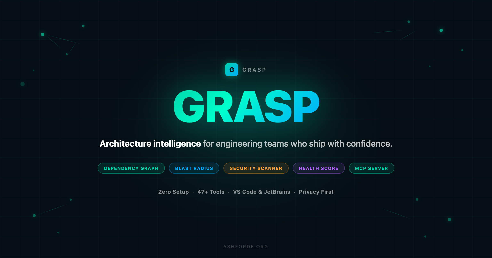
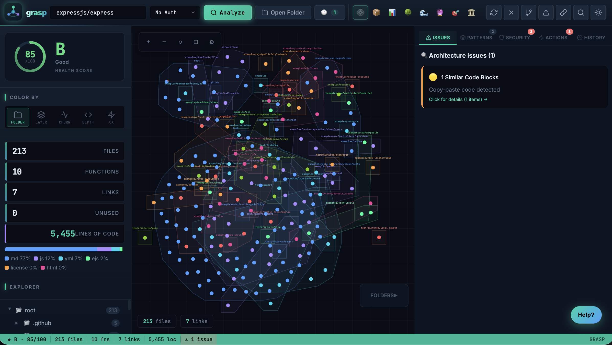
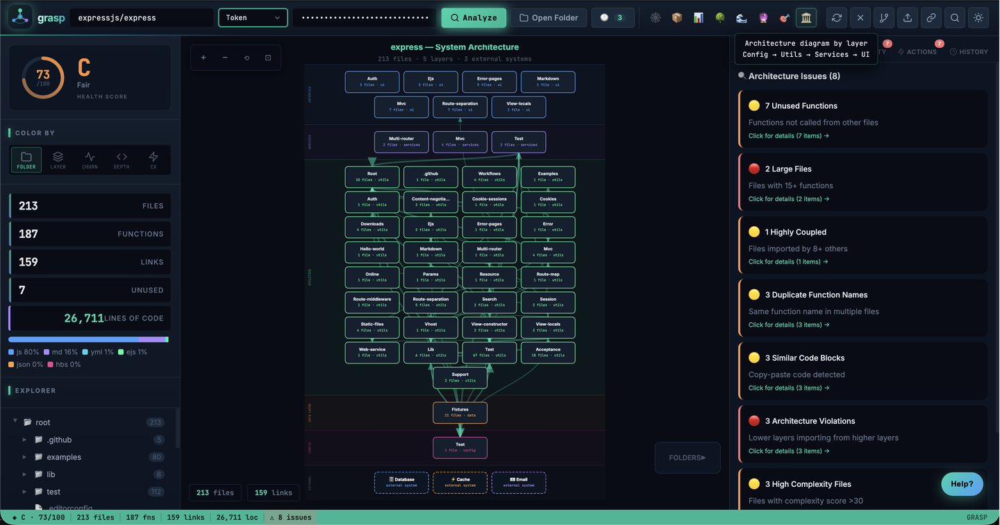
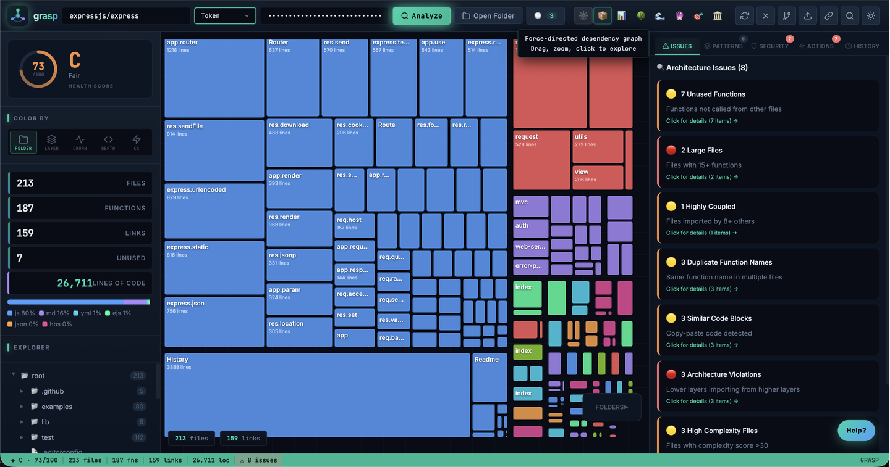
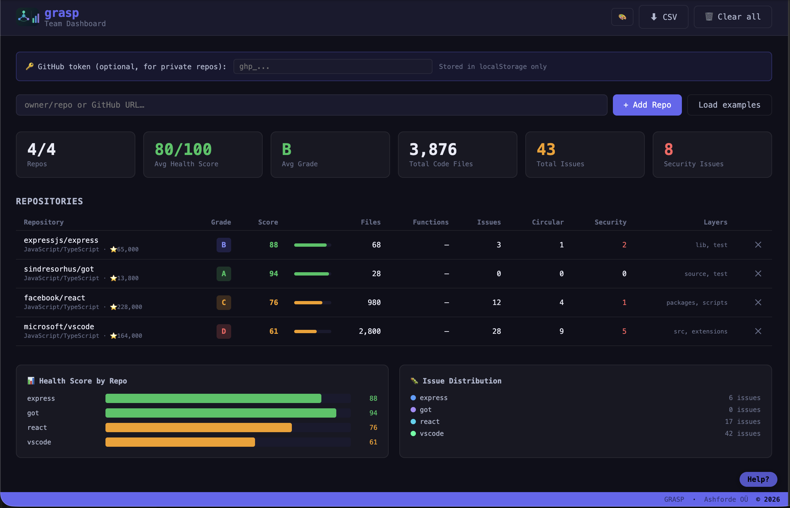

<div align="center">



<br/>
<br/>

<a href="https://github.com/ashfordeOU/grasp/actions/workflows/ci.yml" target="_blank"></a>
<a href="https://www.npmjs.com/package/grasp-mcp-server" target="_blank"></a>
<a href="LICENSE" target="_blank"></a>
<a href="https://ashfordeou.github.io/grasp" target="_blank"></a>

<br/>

**The code architecture suite** — dependency graphs, health scores & security, everywhere you work.

<br/>

<a href="https://ashfordeou.github.io/grasp" target="_blank"></a>
&nbsp;
<a href="https://marketplace.visualstudio.com/items?itemName=ashfordeOU.grasp-vscode" target="_blank"></a>
&nbsp;
<a href="https://www.npmjs.com/package/grasp-mcp-server" target="_blank"></a>
&nbsp;
<a href="https://plugins.jetbrains.com/plugin/31362-grasp--code-architecture-visualizer" target="_blank"></a>
&nbsp;
<a href="https://addons.mozilla.org/firefox/addon/grasp-code-architecture" target="_blank"></a>
&nbsp;
<a href="https://github.com/ashfordeOU/grasp/releases" target="_blank"></a>

<br/>

<a href="https://ashfordeou.github.io/grasp" target="_blank">🌐 Browser App</a> &nbsp;·&nbsp;
<a href="https://www.npmjs.com/package/grasp-mcp-server" target="_blank">📦 MCP Server</a> &nbsp;·&nbsp;
<a href="https://github.com/ashfordeOU/grasp/issues" target="_blank">🐛 Report Bug</a> &nbsp;·&nbsp;
<a href="https://github.com/ashfordeOU/grasp/issues" target="_blank">✨ Request Feature</a> &nbsp;·&nbsp;
<a href="https://ashfordeou.github.io/grasp/docs/privacy.html" target="_blank">🔒 Privacy</a>

</div>

---

## Why Grasp?

Ever opened a new codebase and felt completely lost? **Grasp** turns any GitHub or GitLab repository (cloud or self-hosted) or local codebase into an interactive architecture map in seconds — no setup, no accounts, no data leaving your machine.

```
Paste URL / Select Files → See Architecture → Make Better Decisions
```

- **No installation** — runs 100% in your browser
- **No data collection** — your code never leaves your machine  
- **No accounts** — paste a URL and go
- **Works offline** — analyze local files without internet

---

## Screenshots

### 🕸️ Dependency Graph — see exactly how files connect



### 🏛️ Architecture Diagram — your codebase by layer



### 📦 Treemap — files sized by line count



### 🏢 Team Dashboard — health across all your repos at a glance



---

## Features

### 🏛️ **Architecture Diagram**
Layer-by-layer diagram of your entire codebase. Components grouped by architectural layer (Config, Utils, Data, Services, Components, UI, Test) with dependency arrows between them. Pan, zoom, click any block to explore.

### 🕸️ **Interactive Dependency Graph**
Force-directed graph showing how every file connects. Click any node to highlight its dependencies. Drag, zoom, multi-select with Shift+click.

### 💥 **Blast Radius Analysis**
*"If I change this file, what breaks?"* — Select any file and see exactly how many files would be affected, highlighted directly on the graph.

### 👥 **Code Ownership**
Top contributors for any file based on git history, with line-percentage breakdowns. One-click jump to GitHub Blame.

### 🔐 **Security Scanner**
Automatic detection of:
- Hardcoded secrets & API keys
- SQL injection vulnerabilities
- Dangerous `eval()` usage
- Debug statements left in production

### 🧩 **Pattern Detection**
Automatically identifies Singleton, Factory, Observer/Event patterns, React custom hooks, and anti-patterns (God Objects, high coupling).

### 📊 **Health Score**
Instant A–F grade based on dead code percentage, circular dependencies, coupling metrics, and security issues.

### 🔥 **Activity Heatmap**
Color files by commit frequency to see the hot spots in your codebase. Works for both GitHub repos (via API) and **local repos** (via `git log` — no internet required).

### 🔍 **Graph Node Filtering**
Type in the filter bar at the top of the graph to instantly narrow 200+ nodes down to just the files you care about — matching nodes stay visible, their direct connections dim in, everything else fades out. Press `Escape` to clear.

### 🚫 **Custom Ignore Patterns**
Add your own directory exclusions (e.g. `generated/`, `__mocks__/`, `fixtures/`) via the `⋯ → 🚫 Ignore Patterns` menu. Persists across sessions. Built-in defaults (`node_modules`, `dist`, `.git`, etc.) cannot be removed.

### 📋 **PR Impact Analysis**
Paste a PR URL to see which files it touches and calculate the blast radius of proposed changes before merging.

### 📡 **Live Watch Mode**
Run `grasp . --watch` to start a local dev server with **real-time SSE sync**. Every time you save a file, the browser graph reloads automatically — no manual refresh. A `LIVE` badge appears in the top bar while connected.

### ⏮️ **Time-Travel Architecture Scrubber**
Run `grasp . --timeline` to load your last 30 git commits as a scrubber panel. Drag the slider to any commit — nodes that changed in that commit glow yellow on the graph, so you can watch your architecture evolve over time.

### 🏢 **Team Dashboard** (`team-dashboard.html`)
Track health across multiple repos in one view. Add any public (or private, with a token) GitHub repo and see score, grade, files, issues, circular deps, security findings, architectural layers, **commit activity (7d / 30d)**, **CI status (✅/❌/⏳)**, and a **commit velocity sparkline** — all in a live table with bar charts. Token is shared with the main Grasp app so you only set it once. Export the full table as **CSV or JSON**. Open local folders with 📁 Open Folder (File System Access API).

### 🔄 **Live Team Collaboration** *(v3.3.19)*
Grasp's CLI serves the Team Dashboard at `/dashboard` and can host a real-time collaboration server for your whole team:

```bash
npx grasp --host=0.0.0.0 --room-secrets=backend:pass1,frontend:pass2
```

- **WebSocket sync** — workspace changes (repos, status, notes, ownership) propagate to all connected team members instantly
- **Named rooms** — `?sync_room=backend-team` isolates each team's workspace on the same server
- **Presence indicators** — see who's online in the Sync panel
- **Share links** — ⎘ Copy team link or 👁 Copy read-only link — auto-connect anyone to the room
- **Read-only mode** — `?readonly=1` lets observers see the live dashboard without being able to push changes
- **Password protection** — `--room-secrets=room:password` keeps rooms private
- **REST API** — `GET /api/health` · `GET /api/rooms` · `GET/PUT /api/workspace/:room` for CI/CD and monitoring integration
- **Export / Import JSON** — full workspace backup and restore in one click

> **LAN hosting:** anyone on the same network accesses `http://server-ip:7331/dashboard` — no cloud needed.

### 🤖 **AI Chat Panel**
Built-in AI assistant that knows your entire codebase. Ask *"why is auth.ts a hotspot?"*, *"which files are safest to refactor?"*, *"explain the security issues in this call chain"* — answers reference your live dependency graph, security findings, and architectural layers.

**15 provider families — all in one panel:**

| Provider | Models |
|----------|--------|
| **Anthropic** | Claude Opus 4.7, Sonnet 4.6, Haiku 4.5 |
| **OpenAI** | GPT-4o, GPT-4o mini, o3-mini, o1 |
| **Google Gemini** | Gemini 2.0 Flash, 1.5 Pro, 1.5 Flash |
| **Mistral** | Mistral Small, Mistral Large |
| **Groq** | Llama 3.3 70B, 3.1 8B, Gemma 2 9B |
| **DeepSeek** | DeepSeek Chat, DeepSeek Reasoner |
| **OpenRouter** | Any model slug (100+ models via one key) |
| **Together AI** | Any model slug |
| **Ollama** | Local models (no key needed) |
| **LM Studio** | Local models on any port |
| **Custom** | Any OpenAI-compatible base URL |

**Features:**
- **Multi-turn conversation memory** — full history accumulated per session, persisted in `localStorage` across page refreshes
- **Selected-file context** — when a file is selected in the graph, its layer, functions, complexity, and issues are injected into the AI context automatically
- **Rich codebase context** — top 80 files with metadata, all architecture issues, all security findings, circular dependencies, layer breakdown, dead code count
- **Markdown rendering** — headers, bold/italic, inline code, fenced code blocks with language hints, bullet lists
- **Copy button** per assistant message
- **Custom endpoints** — LM Studio, vLLM, Ollama, any OpenAI-compatible self-hosted inference server
- API key stays in your browser only, never sent anywhere except the chosen provider

### 🎨 **19 Themes**
Full theme system with hover picker and click-to-cycle: **Dark** · **Light** · **Matrix** · **Amber Terminal** · **Dracula** · **Nord** · **Tokyo Night** · **Catppuccin** · **Gruvbox** · **Obsidian Gold** · **Midnight Diamond** · **Carbon** · **Noir** · **Synthwave** · **Ocean Depth** · **Forest** · **Sunset** · **High Contrast** · **Solarized Light**. Theme choice persists across sessions and is shared between Grasp and Team Dashboard.

### 🔎 **Duplicate & Similarity Detection**
The **Dup** color mode highlights files with exact or near-duplicate code — bright red = many duplicates, orange = some, yellow = minor. The `grasp_similarity` MCP tool returns ranked duplicate clusters and code-clone groups for targeted refactoring.

### 🏢 **Monorepo & Workspace Support**
Grasp automatically detects sub-packages in monorepos (`package.json`, `pyproject.toml`, `Cargo.toml`, `go.mod`, `pom.xml`). A **Workspace** sidebar lets you filter the entire visualization to a single package — all graphs, treemaps, and metrics update instantly.

### 📋 **Requirement Traceability** *(ESA / Aerospace)*
Upload a requirements CSV (`REQ-001, description, level`) and see which requirements are covered by code (`@REQ-001` tags), which are missing, and which code files have no requirement tag at all. One-click compliance matrix export. `grasp_req_trace` MCP tool.

### 🔧 **MISRA / Safety-Critical Detection** *(ESA / Aerospace)*
Enable Safety Mode (`⋯ → 🔧 Safety Mode`) to detect MISRA C/C++ and Ada violations: dynamic memory allocation after init, recursive calls, `goto`, `abort()`/`exit()`, and unsafe Ada conversions. Findings appear as a sub-section under the Security tab.

### 🏛️ **DO-178C / ECSS Certification Export** *(ESA / Aerospace)*
One-click export of a structured certification evidence package: software inventory, requirement traceability matrix, complexity analysis, circular dep count, security findings, dead code summary, MISRA violations, and overall health assessment. Available as JSON (machine-readable) and HTML (printable/PDF).

### 🔍 **Anomaly Investigation Mode** *(ESA / Mission Operations)*
Select any file → "🔍 Anomaly Investigation" → instantly see who calls it, what it calls, the full transitive blast radius, recent commits touching the chain, security issues in the call path, and a plain-English summary. Download as a JSON investigation package. `grasp_anomaly` MCP tool.

### 🔁 **Software Reuse Assessor** *(ESA / Cross-project)*
Select two analysis sessions and assess whether a candidate module can be safely reused in a target project. Traffic-light matrix across six dimensions: Interface compatibility, Dependencies, Safety level, Architecture layer, Security issues, Complexity. `grasp_reuse` MCP tool.

### 🔒 **Safety Constraint Tracer** *(AI Safety / Research)*
Mark files as safety gates (constitutional AI filters, output sanitizers). Grasp traces every entry→output path and highlights any that bypass all gates — "ungated paths". A new **Safety** color mode paints the graph red/green/orange by gate coverage. `grasp_safety_trace` MCP tool.

### 🧪 **Research/Production Boundary Enforcer** *(AI Research)*
Define research folders (`research/`, `experiments/`) and production folders (`src/`, `lib/`). Grasp flags any production file that imports from research code, computes a boundary drift metric, and shows it in the health breakdown.

### 📓 **Jupyter Notebook Support** *(AI Research)*
`.ipynb` files now appear in the dependency graph. Grasp extracts code cells, parses imports, and flags reproducibility issues: missing `random.seed`, absolute paths, `!pip install` cells, and `%run` magic dependencies.

### ⚙️ **Training Run Diff** *(AI Research)*
Upload two config files (YAML or JSON) from different training runs. Grasp diffs the hyperparameters, finds which code files read each changed key, and categorises changes into data pipeline, model, eval, and checkpoint stages. `grasp_run_diff` MCP tool.

### 🧪 **Eval Coverage Map** *(AI Safety)*
Auto-detects eval scripts (`evals/`, `*_eval.py`) and traces which model/training code they actually exercise. Safety gates with no eval coverage are flagged as critical gaps. New **Eval Coverage** color mode. `grasp_eval_coverage` MCP tool.

### 🤖 **ML Pipeline DAG** *(AI Research)*
Detects PyTorch, TensorFlow, JAX, HuggingFace, and Lightning patterns and renders a top-down pipeline DAG: Data → Model → Training → Eval → Checkpoint. Flags potential data leakage across stages.

### 📋 **SBOM Generation** *(Enterprise / Compliance)*
Generates a Software Bill of Materials for all first-party files and third-party dependencies (npm, pip, Cargo, Go modules). Output: **CycloneDX 1.4** or **SPDX 2.3** JSON. Optional CVE enrichment via the free OSV API. `grasp_sbom` MCP tool.

### 📊 **DORA Metrics** *(Enterprise / Engineering Managers)*
Pulls Deployment Frequency, Lead Time for Changes, Change Failure Rate, and MTTR directly from GitHub Actions and PR history. Classifies each metric as Elite / High / Medium / Low per the DORA report. Visible in the Team Dashboard and via `grasp_dora` MCP tool.

### 💰 **Technical Debt Quantification** *(Enterprise / CTOs)*
Converts every architectural issue into developer-hours using configurable estimates (circular dep = 4h, god file = 16h, critical security = 8h…) with a coupling multiplier. Shows total developer-days in the health panel, Suggestions tab, and Team Dashboard. 

### 📝 **AI-Powered ADR Generation** *(Enterprise / Architecture)*
One-click generation of Architecture Decision Records in [MADR format](https://adr.github.io/madr/) based on the current analysis and an optional PR diff. Uses your existing AI Chat API key and chosen provider (Anthropic, OpenAI, Gemini, and more). Copy to clipboard or download as `.md`. `grasp_adr` MCP tool.

### 🧰 **Refactor Wizard**
The **Refactor** hints panel (click any file in the graph) shows a prioritized, step-by-step refactor plan for that file — based on fan-in, complexity, duplicate count, layer violations, and churn. The `grasp_refactor` MCP tool generates the same plan as structured output for agents.

### 🔗 **Shareable Embeds**
Click `⋯ → 🔗 Embed` for a modal with a ready-to-paste `<iframe>`, README badge (``), React component snippet, and a direct link — for sharing live health reports in docs, wikis, or dashboards.

### 💻 **Local File Analysis**
- **Privacy First** — your code never leaves your machine
- **Offline Support** — works without internet
- **Drag & Drop** — drag files or folders straight onto the page
- **Recursive scanning** — analyze entire project structures

---

## Quick Start

### IDE Extensions

| IDE | Install |
|-----|---------|
| **VS Code** | [VS Code Marketplace](https://marketplace.visualstudio.com/items?itemName=ashfordeOU.grasp-vscode) or `ext install ashfordeOU.grasp-vscode` |
| **JetBrains** (IntelliJ, WebStorm, PyCharm…) | [JetBrains Marketplace](https://plugins.jetbrains.com/plugin/31362-grasp--code-architecture-visualizer) — search **Grasp** in Settings → Plugins |

Both extensions require the free CLI: `npm install -g grasp-mcp-server`

> **Manual installs:** Every release ships a signed `.zip` (JetBrains) and `.vsix` (VS Code) on the [GitHub Releases page](https://github.com/ashfordeOU/grasp/releases) — useful for air-gapped or enterprise environments.

### Browser Extensions

| Browser | Install |
|---------|---------|
| **Chrome** | [Chrome Web Store](https://chromewebstore.google.com/detail/grasp-code-architecture) — or install `.zip` from [GitHub Releases](https://github.com/ashfordeOU/grasp/releases) |
| **Firefox** | [Firefox Add-ons (AMO)](https://addons.mozilla.org/firefox/addon/grasp-code-architecture) — or install `.xpi` from [GitHub Releases](https://github.com/ashfordeOU/grasp/releases) |
| **Safari** | Download `.zip` from [GitHub Releases](https://github.com/ashfordeOU/grasp/releases) — see sideload instructions below (macOS 13+) |

All three extensions add a floating **Grasp** button on any GitHub or GitLab repo page. Click it to open the dependency graph. Custom Git hosts (self-hosted GitLab, GitHub Enterprise) are supported — the popup detects the hostname and offers a one-click permission grant.

#### 🧭 Safari Sideload Instructions

```bash
curl -sL https://github.com/ashfordeOU/grasp/releases/latest/download/grasp-safari-extension.zip -o /tmp/grasp-safari.zip && unzip -q /tmp/grasp-safari.zip -d /tmp/grasp-safari && mv /tmp/grasp-safari/Grasp.app /Applications/ && open /Applications/Grasp.app
```

Then in Safari: **Settings → Extensions → enable Grasp**. If it doesn't appear, first enable **Safari → Develop → Allow Unsigned Extensions** (turn on the Develop menu under Safari Settings → Advanced).

### Option 1: Self-Host (30 seconds)
```bash
git clone https://github.com/ashfordeOU/grasp.git
cd grasp
open index.html           # Main app
open team-dashboard.html  # Team Dashboard (track multiple repos)
```
No build process. No dependencies. No `npm install`. **Two HTML files.**

### Option 2: Analyze Local Files
1. Open `index.html` in your browser
2. Click **📁 Open Folder**
3. Select the folder to analyze
4. Everything processes entirely in your browser

### Option 3: CLI (terminal)
```bash
npm install -g grasp-mcp-server   # Install once
grasp ./my-project                 # Analyse a local folder
grasp facebook/react               # Analyse a GitHub repo
grasp .                            # Analyse current directory
```
Outputs a colour-coded health report and writes `grasp-report.json`.  
Exit code `0` = CI pass, `1` = issues found.

```bash
# One-off with npx
npx --package=grasp-mcp-server grasp .

# Watch mode — browser reloads live on every file save
grasp . --watch

# Time-travel — load last 30 commits as a scrubber
grasp . --timeline

# PR comment output — print markdown report to stdout
grasp . --pr-comment

# Enforce grasp.yml architecture rules — exit 1 on violations
grasp . --check

# Export SARIF for GitHub Code Scanning upload
grasp . --format=sarif

# Team Dashboard + collaboration server on your LAN
grasp --host=0.0.0.0 --port=7331
#   → main app:       http://server-ip:7331/
#   → team dashboard: http://server-ip:7331/dashboard
#   → health check:   http://server-ip:7331/api/health

# Password-protect collaboration rooms
grasp --host=0.0.0.0 --room-secrets=backend:pass1,frontend:pass2

# Bind to a specific interface (default: 127.0.0.1)
GRASP_HOST=10.0.0.1 grasp .
```

### Architecture Rules (`grasp.yml`)

Add a `grasp.yml` file to your repo to enforce architecture standards in CI:

```yaml
rules:
  - min_health_score: 70          # fail if score drops below 70
  - max_blast_radius: 20          # flag any file that affects 20+ others
```

Run locally with `grasp . --check`, or drop the [GitHub Actions template](docs/examples/grasp-check.yml) into `.github/workflows/`.

### Health Badge

Once the GitHub App is installed, embed a live health badge in your README:

```markdown

```

### @grasp-bot in PRs

Comment `@grasp-bot analyze` on any PR or issue — Grasp will post a full health report inline.

---

## For LLM Agents & AI Tools — MCP Server

Grasp ships a **Model Context Protocol (MCP) server** that exposes the full analysis engine as callable tools for Claude Code, Cursor, and any MCP-compatible agent.

```bash
cd mcp && npm install && npm run build
```

Then add to `~/.claude/claude_mcp_settings.json`:

```json
{
  "mcpServers": {
    "grasp": {
      "command": "node",
      "args": ["/path/to/grasp/mcp/dist/index.js"]
    }
  }
}
```

Or run without installing:

```bash
npx grasp-mcp-server
```

**48 tools available to agents:**

| Tool | What it answers |
|------|----------------|
| `grasp_analyze` | Full analysis of any repo or local path — run first, returns `session_id` |
| `grasp_file_deps` | What does this file depend on? |
| `grasp_dependents` | What breaks if I change this file? |
| `grasp_cycles` | Are there circular dependencies? |
| `grasp_architecture` | What layers does this codebase have? |
| `grasp_hotspots` | Which files are riskiest to touch? |
| `grasp_metrics` | Lines, complexity, fan-in/fan-out per file |
| `grasp_find_path` | How does file A connect to file B? |
| `grasp_security` | Any hardcoded secrets or injection risks? |
| `grasp_patterns` | What design patterns are in use? |
| `grasp_unused` | Which functions are dead code — defined but never called? |
| `grasp_sessions` | List active analysis sessions (survive restarts, expire after 7 days) |
| `grasp_diff` | Compare two analysis snapshots — what changed? |
| `grasp_suggest` | Ranked refactoring suggestions sorted by effort-to-impact ratio |
| `grasp_explain` | Plain-English explanation of any file or function |
| `grasp_watch` | Re-analyse a directory and diff against a previous run |
| `grasp_rules_check` | Run architecture rules and report violations |
| `grasp_refactor` | Step-by-step refactor plan for a file or entire session |
| `grasp_coverage` | Test coverage overlay — which files lack tests? |
| `grasp_issues` | Map GitHub Issues to the files they mention |
| `grasp_contributors` | Per-file ownership, bus-factor, top contributors |
| `grasp_bundle` | Bundle size treemap — largest files by size category |
| `grasp_dep_impact` | Impact of upgrading a dependency across all files |
| `grasp_timeline` | Last N commits with per-commit changed files + co-change matrix |
| `grasp_pr_comment` | Generate PR health comment with blast radius for changed files |
| `grasp_embed` | Generate iframe, README badge, React snippet for sharing |
| `grasp_cross_repo` | Compare two sessions — shared files, diverged functions |
| `grasp_similarity` | Ranked duplicate clusters, code clones, naming clashes |
| `grasp_dead_packages` | npm deps declared in package.json but never actually imported |
| `grasp_sarif` | Export analysis as SARIF 2.1.0 for GitHub Code Scanning |
| `grasp_runtime_calls` | Merge a runtime trace with static edges — actual call paths and hot files |
| `grasp_db_coupling` | ORM/SQL-to-table coupling map — god tables, high-coupling files |
| `grasp_migration_plan` | Phased, topologically-ordered plan for replacing a package/module |
| `grasp_api_surface` | Unified API surface map from OpenAPI, GraphQL SDL, Express/FastAPI routes |
| `grasp_commits` | Commit counts for last 7d and 30d, plus commits since a given timestamp |
| `grasp_ci_status` | Latest GitHub Actions run — passing/failing/in-progress, with recent run history |
| `grasp_env_vars` | Scan all env var reads — flags undocumented and test-only vars vs .env.example |
| `grasp_events` | Map event emitters and subscribers — detect orphaned emits and ghost subscriptions |
| `grasp_stale` | Find active but abandoned files — low churn, high fan-in, no test counterpart |
| `grasp_change_risk` | Risk score 0–100 for a set of changed files — blast radius, complexity, churn combined |
| `grasp_feature_flags` | Find all feature flag reads — LaunchDarkly, GrowthBook, OpenFeature, env-var flags |
| `grasp_perf` | Detect N+1 queries, synchronous I/O calls, and JSON serialization inside loops |
| `grasp_license` | Scan node_modules for dependency licenses — flags copyleft and unknown licenses |
| `grasp_onboard` | Ordered reading path for new engineers entering an area of the codebase |
| `grasp_types` | Type annotation coverage per file — prioritises high fan-in files lacking types |
| `grasp_diagram` | Generate Mermaid flowchart or C4 diagrams from the dependency graph |
| `grasp_pr_review` | Post inline review comments on a GitHub PR at high-severity lines |
| `grasp_config_check` | Validate a session against `grasp.yml` architecture rules — returns violations |

Works with GitHub repos and local directories. See [`mcp/README.md`](mcp/README.md) for full setup.

---

## Usage

### Public Repositories
```
Just paste:   facebook/react
Or full URL:  https://github.com/facebook/react
```

### Private Repositories

**GitHub:** Create a [GitHub Personal Access Token](https://github.com/settings/tokens) with `repo` scope, then select **Token** from the auth dropdown and paste it in. Token stays in memory only.

**GitLab (gitlab.com or self-hosted):** Set `GITLAB_TOKEN=glpat-xxxx` (and optionally `GITLAB_HOST=gitlab.internal.company.com` for self-hosted instances) before starting the MCP server. Paste a GitLab project URL or `namespace/project` path to analyze. See [`mcp/README.md`](mcp/README.md) for Docker bot and tunnel agent options.

### Shareable Links
After analysis, click 🔗 to copy a link anyone can use to re-run the same analysis.

---

## Visualization Modes

### Graph Types

| Type | Description |
|------|-------------|
| 🕸️ **Graph** | Force-directed dependency graph — drag, zoom, click to explore |
| 🔮 **3D Graph** | Three-dimensional force graph — rotate, pan, zoom through your architecture |
| 🏛️ **Arch** | Layer-by-layer architecture diagram with zoom/pan |
| 📦 **Treemap** | Files sized by line count, grouped by folder |
| 📊 **Matrix** | Adjacency matrix showing all file dependencies |
| 🌳 **Tree** | Hierarchical cluster dendrogram |
| 🌊 **Flow** | Folder-level dependency flow (Sankey diagram) |
| 🎯 **Bundle** | Circular layout with arc-based connections |
| 🔮 **Cluster** | Separated force graphs per folder |

### Color Modes

| Mode | Description |
|------|-------------|
| 📁 **Folder** | Color by directory structure |
| 🏗️ **Layer** | Color by architectural layer (UI, Services, Utils, etc.) |
| 🔥 **Churn** | Color by commit frequency — red = most-changed hot spots |
| 🌊 **Depth** | Color by max brace-nesting depth |
| ⚡ **Complexity** | Color by cyclomatic complexity (green → yellow → red) |
| 💥 **Blast** | Color by blast radius impact for a selected file |
| 🔎 **Dup** | Color by duplicate code density — red = many clones, yellow = minor |
| 👤 **Owner** | Color by top contributor — spot bus-factor risks at a glance |
| 🐛 **Issues** | Color by number of linked GitHub Issues mentioning each file |
| 🧪 **Coverage** | Color by test coverage — highlight files with no test counterpart |
| 📦 **Bundle** | Color by bundle size contribution |
| 🌐 **API Surface** | Color by API endpoint exposure — highlight public-facing files |
| ⚡ **Runtime** | Color by actual runtime call frequency from a live trace |
| 🔒 **Safety** | Color by safety gate coverage — green = gated, red = ungated path, orange = safety gate, blue = entry point |
| 🧪 **Boundary** | Color by research/production boundary — blue = production, red = research, yellow = boundary violator |
| 🧪 **Eval Coverage** | Color by eval/test coverage — green = reached by eval scripts, red = not covered, orange = safety gate with no eval |

---

## Advanced Features

### ⚡ Command Palette
Press `Cmd+K` (Mac) / `Ctrl+K` (Windows) — search files, navigate to any function, or jump to issues instantly. Selecting a result pans the graph to that node.

### 🔍 Path Finder
Select two files in the details panel to find the shortest dependency chain between them.

### 🏛️ Architecture Rule Engine
Define custom FORBIDDEN dependency rules (e.g., `utils → services` is FORBIDDEN). Violations are flagged as issues and persist across sessions.

### 📅 History & Snapshots
Every analysis is saved automatically. Click **HISTORY** in the right panel to compare health scores over time with a D3 sparkline and range slider.

### 📤 Export Reports
Export as JSON, Markdown, Plain Text, or SVG. Full schema in [docs/api-schema.md](docs/api-schema.md).

### 🤖 AI Coding Tool Integrations
Grasp works with all major AI coding tools via MCP:
**Claude Code, Cursor, Cline, Roo Code, Kilo Code, OpenCode, Trae, Grok CLI, Codex CLI, Droid**

See [`ai-tools/`](./ai-tools/) for per-tool setup guides.

### 🧩 IDE Extensions (VS Code & JetBrains)
Install from the [VS Code Marketplace](https://marketplace.visualstudio.com/items?itemName=ashfordeOU.grasp-vscode) or [JetBrains Marketplace](https://plugins.jetbrains.com/plugin/31362-grasp--code-architecture-visualizer) for a live dependency graph in your sidebar.

### 🦊 Browser Extensions (Chrome, Firefox & Safari)
One-click install from the [Chrome Web Store](https://chromewebstore.google.com/detail/grasp-code-architecture) or [Firefox Add-ons](https://addons.mozilla.org/firefox/addon/grasp-code-architecture). Safari users can sideload the extension from [GitHub Releases](https://github.com/ashfordeOU/grasp/releases) — see the [sideload instructions](#-safari-sideload-instructions) below. A floating **Grasp** button appears on every GitHub and GitLab repo page. Supports self-hosted GitLab, GitHub Enterprise, and any custom Git host via on-demand permission grants.

### VS Code features:
- Auto-analyses workspace on startup, re-analyses on file save (2s debounce)
- Status bar shows `↑ N deps  ↓ M dependents` for the active file
- Pans to the active file on every editor switch
- Surfaces security issues and arch violations in the **Problems panel** (squiggly lines)
- 4 color mode buttons in the panel header: Layer / Folder / Churn / Complexity
- Health score badge displayed in the panel header
- Double-click any node to open the file in the editor
- Right-click any file in Explorer or Editor → **Grasp: Analyze File** for instant details
- Directed links: blue = outgoing imports, green = incoming dependents
- Rich tooltips showing complexity, churn count, and top contributor per file

---

## Version & Auto-Update

Both `index.html` and `team-dashboard.html` display the current version (`v3.9.4`) in the footer. On load, they silently check the npm registry for a newer `grasp-mcp-server` release. If one is found, a dismissible toast appears:

- **Update Now** — fetches the new HTML from GitHub, downloads it to your machine, and applies it in the current tab immediately
- **Later** — snoozes for 24 hours

No server, no background process. The update check is a single npm registry fetch.

---

## CI/CD Integration

### GitHub Actions — Automatic PR Comments

Add this workflow to get an automatic health report on every PR:

```yaml
# .github/workflows/grasp.yml
name: Grasp Health Check
on:
  pull_request:
    types: [opened, synchronize, reopened]
jobs:
  health:
    uses: ashfordeOU/grasp/.github/workflows/grasp-health.yml@main
```

The workflow posts (and updates) a comment like this on every PR:

| Metric | Value |
|--------|-------|
| **Health Score** | `████████░░` **82/100** |
| **Grade** | 🟢 **A** |
| **Files** | 142 (891 functions) |
| **Architecture Issues** | 3 |
| **Circular Deps** | 0 ✓ |
| **Security** | 0 |
| **Changed Files** | 5 code files in this PR |

### CLI-based CI Gate

```yaml
- name: Check Grasp health
  run: |
    PASSED=$(cat grasp-report.json | jq '.ci.passed')
    SCORE=$(cat grasp-report.json | jq '.ci.score')
    echo "Health score: $SCORE"
    if [ "$PASSED" != "true" ]; then
      echo "Grasp CI check failed"
      cat grasp-report.json | jq '.ci.failures'
      exit 1
    fi
```

See [docs/api-schema.md](docs/api-schema.md) for the full export schema.

---

## Keyboard Shortcuts

| Key | Action |
|-----|--------|
| `Enter` | Analyze repository |
| `Cmd+K` / `Ctrl+K` | Open command palette |
| `+` / `-` | Zoom in/out |
| `Shift+click` | Multi-select nodes |
| `Escape` | Close modal / command palette |
| `T` | Cycle through themes |
| `?` | Open help modal |

---

## Supported Languages

JavaScript · TypeScript · Python · Go · Java · Rust · C/C++ · C# · Ruby · PHP · Swift · Kotlin · Scala · Vue · Svelte · Dart · Elixir · Erlang · Haskell · Lua · R · Julia · Perl · Shell · PowerShell · F# · OCaml · Clojure · Elm · VBA · Groovy

---

## Privacy & Security

**Your code stays on your machine.**

**Browser app:**
- Runs 100% in the browser — no server, no proxy
- GitHub API calls go directly from your browser to GitHub
- Your token (if used) lives in `localStorage` only — never sent anywhere except the GitHub API
- No analytics, no tracking, no accounts
- The entire app is [one open-source HTML file](index.html) — audit it yourself

**MCP server:**
- Runs locally as a subprocess — no outbound connections except the GitHub API
- No telemetry, no data collection
- Local directory analysis never leaves your machine — files are read and discarded in memory

---

## Architecture

```
┌──────────────────────────────────────────────────────────────────────┐
│                              Grasp v3.9.4                            │
├─────────────────────┬──────────────────┬────────────┬───────────────┤
│    Browser App      │  Team Dashboard  │ MCP Server │  VS Code Ext  │
│    (index.html)     │(team-dashboard   │  (mcp/)    │(vscode-ext/)  │
│                     │      .html)      │            │               │
│  ┌─────────────┐    │  ┌───────────┐   │ ┌────────┐ │ ┌───────────┐ │
│  │Parser Engine│◄───┼──│parser.js  │   │ │parser  │ │ │Webview    │ │
│  │(embedded JS)│    │  └─────┬─────┘   │ └───┬────┘ │ │(D3 graph) │ │
│  └──────┬──────┘    │        │         │     │      │ └─────┬─────┘ │
│         │           │  ┌─────▼──────┐  │ ┌───▼────┐ │       │       │
│  ┌──────▼──────┐    │  │Multi-repo  │  │ │analyze │ │ ┌─────▼─────┐ │
│  │React+D3     │    │  │health table│  │ └───┬────┘ │ │FileWatcher│ │
│  │19 themes    │    │  │score charts│  │     │      │ │Status Bar │ │
│  │AI Chat      │    │  │CSV/JSON    │  │ ┌───▼────┐ │ │Diagnostics│ │
│  │15 providers │    │  │WS sync     │  │ │48 Tools│ │ └───────────┘ │
│  │3D Graph     │    │  │rooms+presence│ │(stdio) │ │               │
│  │ESA/AI/Ent.  │    │  └────────────┘  │ └────────┘ │               │
│  │Verticals    │    │                  │            │               │
│  │Workspaces   │    │  WebSocket sync  │ + CLI      │ + context menu│
│  └─────────────┘    │  LAN hosting     │            │               │
│  Zero install —     │  one HTML file   │            │               │
│  one HTML file      │                  │            │               │
└─────────────────────┴──────────────────┴────────────┴───────────────┘
```

**Browser app:** zero dependencies to install. Everything runs from CDNs: React 18, D3.js 7, Babel.

**MCP server:** Node.js 18+, `npm install` inside `mcp/`.

**VS Code extension:** `vsce package` inside `vscode-extension/`.

---

## GitHub API Limits

| Auth | Requests/hour |
|------|--------------|
| No token | 60 |
| Personal Access Token | 5,000 |
| GitHub App | 5,000 per installation |

---

## Contributing

See [CONTRIBUTING.md](CONTRIBUTING.md) for setup, code structure, and PR checklist.

Ideas welcome:
- [x] More languages (Zig, V, Nim, Crystal)
- [x] Full tree-sitter / AST support for JS/TS function extraction (MCP + CLI now use acorn in Node.js)
- [x] More design pattern detection (Strategy, Command, State)
- [x] Export to PNG
- [x] 3D force graph visualization mode
- [x] 19-theme system with hover picker — Matrix, Synthwave, Dracula, Nord, Tokyo Night, Catppuccin, Gruvbox, Obsidian Gold, Midnight Diamond, Carbon, Noir, Amber Terminal, Ocean Depth, Forest, Sunset, High Contrast, Solarized Light
- [x] Team Dashboard (`team-dashboard.html`) — multi-repo health tracking, commit activity (7d/30d), CI status badges, commit velocity sparkline, CSV/JSON export, shared token/theme, Open Folder
- [x] Team Dashboard Live Collaboration — WebSocket sync rooms, LAN hosting (`--host=0.0.0.0`), presence indicators, read-only links, room passwords, REST API, Export/Import JSON
- [x] AI Chat panel — 15 provider families (Anthropic, OpenAI, Gemini, Mistral, Groq, DeepSeek, OpenRouter, Together AI, Ollama, LM Studio, custom endpoint), multi-turn conversation memory, markdown rendering, copy button, selected-file context
- [x] Auto-update system — version check via npm registry, in-tab update + file download
- [x] MCP: 48 tools total — added `grasp_dead_packages`, `grasp_sarif`, `grasp_runtime_calls`, `grasp_db_coupling`, `grasp_migration_plan`, `grasp_api_surface`, `grasp_commits`, `grasp_ci_status`, `grasp_env_vars`, `grasp_events`, `grasp_stale`, `grasp_change_risk`, `grasp_feature_flags`, `grasp_perf`, `grasp_license`, `grasp_onboard`, `grasp_types`, `grasp_diagram`, `grasp_pr_review`
- [x] MCP: `grasp_diff` tool — compare two snapshots over time
- [x] MCP: `grasp_suggest` tool — refactoring suggestions from hotspot data
- [x] MCP: `grasp_explain` tool — plain-English file/function explanation
- [x] MCP: `grasp_watch` tool — re-analyse directory and diff against prior run
- [x] MCP: `grasp_unused` tool — dead code detection for agents
- [x] MCP: `grasp_rules_check` tool — architecture rule violations
- [x] MCP: `grasp_issues` tool — GitHub Issues → file mention mapping
- [x] MCP: `grasp_contributors` tool — per-file ownership and bus-factor
- [x] MCP: `grasp_bundle` tool — bundle size treemap
- [x] MCP: `grasp_dep_impact` tool — dependency upgrade impact analysis
- [x] MCP: `grasp_coverage` tool — test file coverage overlay
- [x] MCP: `grasp_timeline` tool — git history with co-change matrix
- [x] MCP: `grasp_pr_comment` tool — PR health comment with blast radius
- [x] MCP: `grasp_embed` tool — shareable iframe, badge, React snippet
- [x] MCP: `grasp_refactor` tool — step-by-step refactor plan
- [x] MCP: `grasp_cross_repo` tool — compare two sessions / monorepo support
- [x] MCP: `grasp_similarity` tool — duplicate clusters and code clones
- [x] MCP: `grasp_dead_packages` — npm deps declared but never imported
- [x] MCP: `grasp_sarif` — SARIF 2.1.0 export for GitHub Code Scanning
- [x] MCP: `grasp_runtime_calls` — merge live trace with static graph
- [x] MCP: `grasp_db_coupling` — ORM/SQL table coupling map
- [x] MCP: `grasp_migration_plan` — phased package migration plan
- [x] MCP: `grasp_api_surface` — unified API surface from OpenAPI, GraphQL, Express/FastAPI routes
- [x] CLI: `grasp ./my-project` opens browser pre-loaded (local server + `--report` for terminal)
- [x] CLI: `grasp . --watch` — live SSE browser sync, LIVE badge in UI
- [x] CLI: `grasp . --timeline` — inject last 30 commits as time-travel scrubber
- [x] CLI: `grasp . --pr-comment` — print PR comment markdown to stdout
- [x] GitHub Action: post health score as PR comment, updates on re-push
- [x] Graph: Color modes for Duplicate density, Code Ownership, GitHub Issues, Coverage, Bundle, API Surface, Runtime
- [x] Graph: Workspace sidebar for monorepo sub-package filtering
- [x] Graph: Refactor hints panel per selected file
- [x] Graph: Shareable embed modal (iframe, badge, direct link)
- [x] Graph: Timeline scrubber — yellow glow on changed nodes per commit
- [x] Graph: persist pinned node positions across sessions
- [x] Graph: Cmd+K search pans to the matching node
- [x] Graph: minimap overlay for large codebases
- [x] Function-level call graph drill-down per file
- [x] VS Code: auto-reanalyse on file save (2s debounce)
- [x] VS Code: 4 color mode buttons in panel header
- [x] VS Code: health score badge in panel header
- [x] VS Code: double-click node to open file in editor
- [x] VS Code: right-click → Grasp: Analyze File context menu
- [x] VS Code: directed link colors (blue = outgoing, green = incoming)
- [x] VS Code: rich node tooltips (complexity, churn, contributor)
- [x] VS Code: status bar item showing deps/dependents for active file
- [x] VS Code: Problems panel integration — security + arch violations as diagnostics
- [x] Custom ignore patterns UI — add/remove directory exclusions, persists in localStorage
- [x] Local git history — churn heatmap works for local repos via `git log`
- [x] GitLab repository support (gitlab.com + self-hosted)
- [x] Pro tier API keys (gsp_ prefix, tier-based rate limits)
- [x] Analysis history store (90-day rolling window, sparkline chart)
- [x] Team Dashboard leaderboard ranked by health score
- [x] Slack Block Kit interactive digest with per-repo action buttons
- [x] Cursor IDE integration (MCP config template, 48-tool guide)
- [x] GitHub Marketplace listing assets (description, pricing, screenshots)
- [x] Automated npm publish on git tags via GitHub Actions

---

## License

**Elastic License 2.0** — Copyright (c) 2026 Ashforde OÜ.

Free to use, modify, and self-host. You may not offer Grasp as a hosted or managed service, strip copyright notices, or redistribute it under a different brand. See [LICENSE](LICENSE) for full terms.

---

<div align="center">

**Architecture intelligence for engineering teams who ship with confidence.**

*See the code. Know the code.*

</div>
