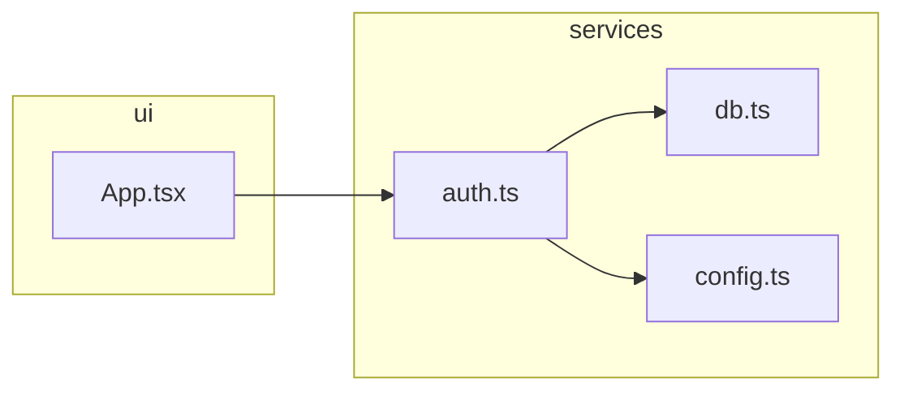

# Grasp v2.3 → v2.9 Feature Design

**Date:** 2026-04-19  
**Scope:** 7 phases, ~65 tasks, versions 2.3.0 through 2.9.0  
**Author:** Ashforde OÜ

---

## Overview

This document covers the full design for the next major feature wave across the Grasp MCP server, CLI, browser apps, and editor plugins. The work spans 7 phases, each shipping as an independent semver minor release.

---

## Current State

- **36 MCP tools** in `mcp/src/index.ts` (3,007 lines)
- **Session model:** in-memory `Map<string, AnalysisResult>` — dies on MCP server restart
- **Source files:** `analyzer.ts`, `api-surface.ts`, `cli.ts`, `db-coupling.ts`, `dead-packages.ts`, `migration-planner.ts`, `parser.js`, `runtime-tracer.ts`, `sarif.ts`, `types.ts`
- **Sources:** `sources/github.ts`, `sources/local.ts`
- **Parser:** regex-based for Go, Rust, Java imports
- **Editor plugins:** VS Code (full), JetBrains (full), Neovim (none)

---

## Architecture Decisions

### 1. Disk-Primary Session Cache

**Decision:** Sessions write through to `~/.grasp/sessions/` on creation. Memory is a runtime cache only. On lookup, if not in memory, load from disk.

**Rationale:** Consistent with Grasp's "your code never leaves your machine" promise. Enables `grasp_diff`, `grasp_timeline`, and health trend stories across days/weeks. Mirrors how Claude Code (`~/.claude/`) and npm (`~/.npm/`) handle local state.

**Schema:**
```
~/.grasp/sessions/
  {session_id}.json       ← full AnalysisResult, gzipped JSON
  index.json              ← { [session_id]: { repo, createdAt, size, lastAccessed } }
```

**TTL:** 7 days default, configurable via `GRASP_SESSION_TTL` env var (days).  
**LRU limit:** 20 sessions default, configurable via `GRASP_SESSION_LIMIT`.  
**Eviction:** On write, if count > limit, delete oldest by `lastAccessed`.

### 2. New Source Files (not crammed into index.ts)

Each major new capability gets its own source file to keep `index.ts` as thin tool-registration code:

| New File | Responsibility |
|---|---|
| `src/session-store.ts` | Disk-primary session cache |
| `src/env-scanner.ts` | Env var pattern scanning |
| `src/event-mapper.ts` | Pub/sub graph builder |
| `src/license-scanner.ts` | Dependency license scanning |
| `src/flag-tracker.ts` | Feature flag tracking |
| `src/perf-analyzer.ts` | N+1 / performance pattern detection |
| `src/diagram-gen.ts` | Mermaid / C4 diagram generation |
| `src/parsers/go.ts` | Go import parser |
| `src/parsers/rust.ts` | Rust import parser |
| `src/parsers/java.ts` | Java import parser |

### 3. New Tools Summary

12 new MCP tools (36 → 48 total), plus 1 enhancement to `grasp_suggest`:

| Tool | Category | Phase |
|---|---|---|
| `grasp_env_vars` | Security / Docs | 2 |
| `grasp_events` | Architecture | 2 |
| `grasp_stale` | Code Quality | 2 |
| `grasp_change_risk` | Risk Assessment | 2 |
| `grasp_feature_flags` | Code Quality | 2 |
| `grasp_perf` | Performance | 2 |
| `grasp_onboard` | Intelligence | 3 |
| `grasp_license` | Compliance | 3 |
| `grasp_types` | Quality Metrics | 3 |
| `grasp_diagram` | Export | 4 |
| `grasp_pr_review` | GitHub Integration | 4 |
| `grasp_suggest` *(enhanced)* | Refactoring | 3 |

### 4. Version Strategy

Each phase ships as a semver minor (new tools are additive, non-breaking). Parser improvements in Phase 5 may change analysis output for Go/Rust/Java repos — treated as minor since results only improve.

| Phase | Version | Theme |
|---|---|---|
| 1 | v2.3.0 | Persistent Session Cache |
| 2 | v2.4.0 | Core Analysis Tools (6 new) |
| 3 | v2.5.0 | Intelligence Tools (3 new + 1 enhanced) |
| 4 | v2.6.0 | Diagram & Export (2 new) |
| 5 | v2.7.0 | Parser Quality (Go / Rust / Java) |
| 6 | v2.8.0 | CLI & DX |
| 7 | v2.9.0 | Editor & UI |

---

## Phase 1 — Persistent Session Cache (v2.3.0)

**Goal:** Sessions survive MCP server restarts. Unlocks the entire "trends over time" story.

### New File: `src/session-store.ts`

```typescript
interface SessionMeta {
  repo: string;           // "owner/repo" or "local:path"
  createdAt: string;      // ISO
  lastAccessed: string;   // ISO
  sizeBytes: number;
}

class SessionStore {
  private dir: string;           // ~/.grasp/sessions/
  private memory: Map<string, AnalysisResult>;
  private ttlDays: number;
  private maxSessions: number;

  async get(id: string): Promise<AnalysisResult | null>
  async set(id: string, result: AnalysisResult): Promise<void>
  async list(): Promise<Array<SessionMeta & { id: string }>>
  async delete(id: string): Promise<void>
  private async evict(): Promise<void>   // LRU eviction
  private async prune(): Promise<void>   // TTL cleanup
}
```

Sessions are stored as gzipped JSON (`{id}.json.gz`) to keep disk usage reasonable. The `index.json` file is the fast-lookup manifest — read on startup, updated on every write.

### Impact on Existing Tools

- `grasp_analyze` — writes session to disk after building in memory
- `grasp_sessions` — reads from `index.json` (shows disk sessions, not just in-memory)
- All other tools — `sessions.get(id)` becomes `await sessionStore.get(id)` (async)
- `grasp_diff` / `grasp_watch` — can now diff sessions from days ago

### Tests

- Write session → restart simulation → read session → assert equal
- TTL: write with `createdAt` 8 days ago → prune → assert deleted
- LRU: write 21 sessions → assert oldest evicted
- Index integrity: corrupt index → graceful fallback to directory scan

---

## Phase 2 — Core Analysis Tools (v2.4.0)

### `grasp_env_vars`

**What:** Scans every file for environment variable reads. Cross-references with `.env.example`. Reports: all vars found, which layer each is read from, vars undocumented in `.env.example`, vars only read in test files.

**Implementation (`src/env-scanner.ts`):**
- Patterns: `process.env.X`, `os.getenv('X')`, `os.environ['X']`, `os.environ.get('X')`, `config.get('X')`, `getenv('X')`
- Regex per language, applied to file content
- `.env.example` parser: extract declared var names
- Layer tagging from `AnalyzedFile.layer`

**Output:**
```
{ vars: [{name, files, layers, inEnvExample, testOnly}], undocumented: [...], testOnly: [...] }
```

---

### `grasp_events`

**What:** Maps event emitters and subscribers across the codebase. Builds a separate pub/sub dependency graph invisible to import analysis.

**Implementation (`src/event-mapper.ts`):**
- Patterns detected:
  - Node.js: `EventEmitter.emit('X')`, `.on('X', ...)`, `.once('X', ...)`
  - Browser: `addEventListener('X', ...)`, `dispatchEvent(new Event('X'))`
  - Redux: `dispatch({type: 'X'})`, `createAction('X')`, `on('X', ...)`  
  - Pub/sub libs: `.publish('X')`, `.subscribe('X')`, `.trigger('X')`
  - Custom: configurable patterns
- Output: event name → emitter files, subscriber files
- Detects orphaned events (emitted, never subscribed) and ghost subscribers (subscribed, never emitted)

**Output:**
```
{ events: [{name, emitters: [{file, line}], subscribers: [{file, line}], orphaned, ghost}] }
```

---

### `grasp_stale`

**What:** Files and functions that are active (imported by others) but abandoned — untouched for N months, no test counterpart, high fan-in. The "this probably still works but nobody knows why" list.

**Implementation:** Uses existing `churn` data (git commit recency) + `grasp_coverage` test-file detection + `fanIn` from connections graph.

**Scoring:** `staleness = (months_since_change × 0.4) + (fanIn × 0.35) + (no_test × 0.25)` — normalized 0–100.

**Parameters:** `min_months` (default 3), `min_fan_in` (default 2), `limit` (default 20).

---

### `grasp_change_risk`

**What:** Given a list of changed files (PR diff), outputs a composite risk score 0–100 with per-component breakdown.

**Formula:** `risk = blast_radius_score × 0.35 + avg_complexity_score × 0.25 + churn_frequency_score × 0.20 + layer_violations_score × 0.20`

Each component normalized to 0–100 before weighting. Final score ≤ 33 = low, 34–66 = medium, 67+ = high.

**Distinction from `grasp_pr_comment`:** `grasp_pr_comment` generates a markdown comment for humans. `grasp_change_risk` returns a single structured number for agent decision-making (e.g. "if risk > 70, require second reviewer").

---

### `grasp_feature_flags`

**What:** Finds all feature flag reads in the codebase and maps which files depend on which flags.

**Implementation (`src/flag-tracker.ts`):**
- Patterns:
  - LaunchDarkly: `ldClient.variation('flag-name', ...)`, `useFlags()`, `useLDClient()`
  - GrowthBook: `gb.isOn('flag')`, `gb.getFeatureValue('flag', ...)`
  - Env-var flags: `process.env.FEATURE_X`, `process.env.FF_X`, `process.env.ENABLE_X`
  - OpenFeature: `client.getBooleanValue('flag', ...)`
  - Custom: any call matching `flags.get(`, `features.enabled(`, `isFeatureEnabled(`
- Output: flag name → files, blast radius if flag removed, stale flags (no recent access in git log)

---

### `grasp_perf`

**What:** Static pattern matching for common performance anti-patterns.

**Patterns detected (`src/perf-analyzer.ts`):**
- **N+1:** ORM call inside a for/while loop (`for (...) { Model.find(...)`, `for (...) { db.query(` )
- **Missing await:** `async` function calling another `async` function without `await`
- **Sync on hot path:** `fs.readFileSync`, `JSON.parse` called from a frequently-imported (high fan-in) file
- **Serialization in loop:** `JSON.stringify`/`JSON.parse` inside loops
- **Missing index hint:** SQL query with `WHERE` but no `LIMIT` in a loop

Each finding includes file, line, pattern name, severity (critical/warning), and a fix suggestion.

---

## Phase 3 — Intelligence Tools (v2.5.0)

### `grasp_onboard`

**What:** Given a target area (file, function, or concept like "auth"), produces an ordered reading path for a new engineer.

**Algorithm:**
1. Find entry-point files for the target (files that match the query by name/layer)
2. Build dependency subgraph rooted at those files
3. Topologically sort by layer + fan-in (high fan-in = "must understand first")
4. Filter out pure util files that are self-explanatory
5. Annotate each file with: why it matters, what to read in it, what it connects to

**Output:** Ordered list of 5–15 files with rationale per file. Tokens-aware — keeps under 2000 tokens.

---

### `grasp_license`

**What:** Scans `node_modules/` (npm) or `site-packages/` (Python) and reports all dependency licenses.

**Implementation (`src/license-scanner.ts`):**
- npm: reads `node_modules/{pkg}/package.json` → `.license` or `.licenses[]`
- Python: reads `{pkg}-{ver}.dist-info/METADATA` → `License:` header
- Categories: `permissive` (MIT, Apache-2.0, BSD-*, ISC), `copyleft` (GPL-*, LGPL-*, AGPL-*), `unknown`
- Parameters: `allowed_licenses` (array of SPDX identifiers), `flag_copyleft` (boolean)
- Output: per-dep license, summary counts, violations list

---

### `grasp_types`

**What:** Reports type annotation coverage per file — % of functions with full parameter + return type annotations.

**TypeScript:** Counts functions where all parameters have type annotations and return type is explicit (not inferred). Uses existing acorn parse tree.

**Python:** Scans for PEP 484 annotations (`def foo(x: int, y: str) -> bool:`). Counts fully-annotated vs partially vs unannotated functions.

**Output:** Per-file coverage %, repo-wide average, top 10 least-annotated files by fan-in (highest-leverage to annotate first).

---

### `grasp_suggest` Enhancement

**What:** Add effort-to-impact ratio as the primary sort key (alongside existing severity).

**Effort score:** Estimated from function count in file + fan-in (high fan-in = harder to safely change) + churn (frequently changed = riskier to touch).

**Impact score:** Complexity reduction potential (cyclomatic complexity × dependents count).

**Ratio:** `impact / effort` — sort descending. "Fix this in 10 minutes, saves 40% of complexity" rises to the top over "massive refactor, minor improvement."

---

## Phase 4 — Diagram & Export (v2.6.0)

### `grasp_diagram`

**What:** Generates Mermaid flowchart or C4 architecture diagrams from analysis data. Paste directly into GitHub wikis, Notion, Confluence.

**Implementation (`src/diagram-gen.ts`):**

**Mermaid flowchart (default):**

Grouped by architectural layer. Edges from connection graph. Color-coded by health (red = security issue, amber = circular dep).

**C4 Context:** System box + external actors (GitHub API, database, external services detected from imports).

**C4 Container:** Each layer as a container box with inter-layer arrows. Tech stack labelled per container.

**C4 Component:** Per-layer breakdown showing individual files as components.

**Parameters:** `session_id`, `format` (mermaid | c4-context | c4-container | c4-component), `max_nodes` (default 50, prunes to hotspots beyond limit).

**CLI:** `grasp analyze ./my-project --format=mermaid` → writes diagram to stdout.

---

### `grasp_pr_review`

**What:** Posts inline review comments on a GitHub PR at the exact lines that are dangerous — high complexity, circular dep risk, layer violation.

**Implementation:**
- Input: `repo` (owner/repo), `pr_number`, `session_id`, `token`
- Fetches PR diff from GitHub API (`/repos/{owner}/{repo}/pulls/{pr}/files`)
- Parses diff hunks to get line positions
- For each changed line that has a finding (from security/issues/complexity data), maps to diff position
- Posts a GitHub Review via `POST /repos/{owner}/{repo}/pulls/{pr}/reviews` with `comments[]` array
- Findings threshold: only posts for complexity > 15, direct circular dep participant, or security issue

**Distinct from `grasp_pr_comment`:** That posts one summary comment. This posts inline line-level comments like Reviewdog or CodeClimate — reviewers see warnings exactly on the dangerous lines.

---

## Phase 5 — Parser Quality (v2.7.0)

### Go Import Parser (`src/parsers/go.ts`)

Replaces regex with structured parsing:
- `import "github.com/pkg/name"` → single import
- `import alias "pkg"` → aliased import, track alias
- Import groups: `import ( "pkg1"; "pkg2" )` — parse block correctly
- Stdlib detection: no dot in package path → skip or mark as stdlib
- Module resolution: reads `go.mod` for module name to resolve internal imports

### Rust Import Parser (`src/parsers/rust.ts`)

- `use crate::module::item` → internal dep on `module`
- `use std::...` → stdlib, skip
- `use super::...` → relative, resolve to parent
- `extern crate name` → external dep
- Re-exports: `pub use ...` → track as providing the symbol to dependents
- `mod module;` → declares submodule (creates file dependency on `module.rs`)

### Java Import Parser (`src/parsers/java.ts`)

- `import com.example.service.UserService` → dep on `UserService.java`
- `import static com.example.Utils.method` → static import, track file-level dep
- Wildcard: `import com.example.*` → mark dep on entire package (fuzzy — flag in output)
- Package declaration: `package com.example.service` → sets file's own package for internal resolution

All three parsers plugged into `analyzer.ts` language dispatch table, replacing current regex for those extensions.

---

## Phase 6 — CLI & DX (v2.8.0)

### Progress Bar

`analyzeSource()` gains an optional `onProgress(done: number, total: number, file: string)` callback. CLI wires this to a stderr progress bar — in-place readline update so it doesn't pollute stdout (which carries the JSON/text report).

Format: `Analyzing... [████████░░░░░░░░] 127/312 src/services/auth.ts`

### `--watch` Mode

```bash
grasp . --watch
```

Uses native `fs.watch` (recursive) with 500ms debounce. On change: re-runs `analyzeSource` on the full directory, diffs against previous session, prints delta to stdout. Compatible with existing `--format` flags. Exits cleanly on `Ctrl+C`.

### Health Badge (SaaS)

Requires a hosted endpoint — wire through `saas/` layer. `GET /badge/:owner/:repo.svg` → SVG with current health grade. Deferred until SaaS is deployed; included here as a planned endpoint stub.

---

## Phase 7 — Editor & UI (v2.9.0)

### Neovim Plugin (`neovim-plugin/`)

Directory structure:
```
neovim-plugin/
  plugin/grasp.lua        ← auto-loaded, registers commands
  lua/grasp/init.lua      ← core logic
  lua/grasp/ui.lua        ← floating window rendering
  README.md
```

Commands:
- `:GraspAnalyze` — runs `grasp analyze` on cwd, shows health score in floating window
- `:GraspHotspots` — lists top 10 hotspot files in a picker (telescope integration if available)
- `:GraspDeps` — shows deps/dependents for file under cursor in floating window
- `:GraspStale` — lists stale files

Status line: exports `require('grasp').health_score()` for lualine/airline integration.

All commands call the `grasp` CLI binary as a subprocess (no MCP dependency in the plugin — just the CLI).

---

### Coupling Matrix Heatmap (`index.html`)

New visualization mode: **Heatmap**.

- Grid: files × files (sorted by folder)
- Cell color: coupling strength between file A and file B (0 = no dep, 1 = direct, 2+ = transitive)
- Color scale: white → amber → red
- Hover: shows the dependency path between the two files
- Click: selects both files and highlights path in the graph view
- Toggle: added alongside existing Matrix mode button

This is an enhancement to the existing Matrix view, not a replacement.

---

### Browser & Help Updates

Both `index.html` and `team-dashboard.html` help sections updated for all new tools. `index.html` gets a new "Heatmap" color mode entry. MCP tool count updated: 36 → 48.

---

## Testing Approach

Each phase follows TDD:
- New source files get unit tests in `mcp/tests/`
- New tools get integration tests (mock session → call tool → assert output shape)
- Parser tests run against real sample files (`tests/fixtures/`)
- CLI tests use `child_process.execSync` against the built binary
- Neovim plugin tested manually (no automated Lua test runner required)

---

## File Change Summary

| File | Change |
|---|---|
| `mcp/src/session-store.ts` | New |
| `mcp/src/env-scanner.ts` | New |
| `mcp/src/event-mapper.ts` | New |
| `mcp/src/license-scanner.ts` | New |
| `mcp/src/flag-tracker.ts` | New |
| `mcp/src/perf-analyzer.ts` | New |
| `mcp/src/diagram-gen.ts` | New |
| `mcp/src/parsers/go.ts` | New |
| `mcp/src/parsers/rust.ts` | New |
| `mcp/src/parsers/java.ts` | New |
| `mcp/src/index.ts` | Add 12 tools, update session calls, wire parsers |
| `mcp/src/analyzer.ts` | Wire new parsers, add progress callback |
| `mcp/src/cli.ts` | Add `--format=mermaid/c4`, `--watch`, progress bar |
| `mcp/src/types.ts` | Add new types for all new tools |
| `mcp/package.json` | Version bumps per phase |
| `mcp/README.md` | Update tool count and docs per phase |
| `index.html` | Heatmap mode, help updates, version bumps |
| `team-dashboard.html` | Help updates, version bumps |
| `neovim-plugin/` | New directory |
| `README.md` | Tool count, feature list, version updates per phase |
